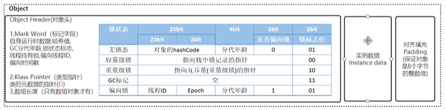

## 多态

没有继承就没有多态。

Java 多态的表现形式有**方法重载**，**重写**，**多态变量**和**泛型**

```java
class Animal{
    void m1(){
        println("Animal");
    }
}
class Chicken extends Animal{
    void m1(){
        println("Chicken");
    }
}
class Dog extends Animal{
    void m1(){
        println("Dog");
    }
}
```


## 接口和抽象类

#### 抽象类：

> 1. abstract 关键字修饰
>
> 2. 不能被实例化只能被继承
>
> 3. 抽象类中的方法的修饰符只能是 public 和 protected
>
> 4. 一个子类继承抽象类，必须实现父类抽象方法
> 5. 方法可以被实现
> 6. 不带花括号

#### 接口：

> 1. 接口中的变量被隐士的定义为 public static final，必须被赋值，方法被隐士定义为 public abstract（jdk 1.8 之前）
> 2. 不能被实例化
> 3. 多继承
>
> **jdk 1.8 之后：**
>
> 1. 支持默认方法（default method）：允许给接口添加非抽象方法实现，必须使用 default 关键字修饰；定义了default的方法可以不被实现子类所实现，但只能被实现子类的对象调用；如果子类实现了多个接口，并且这些接口包含一样的默认方法，则子类必须重写默认方法
> 2. 静态方法（static method）：允许使用 static 关键字修饰一个方法，并提供实现。 

## 对象



### 1. 对象头

#### 		1. Mark Word

​			

#### 		2. 指向类的指针


#### 		3. 数组长度


### 2. 实例数据


### 3. 对齐填充字节


## Lambda 

​	优点：代码简洁；非常容易进行并行计算，改善了集合操作（引入 Stream API）

​	缺点：可读性变差；不容易调试；性能方面，在非并行计算中很多时候并没有传统的 for 循环快（并行计算有时需要预热才显示出效率优势）

## Stream

​	是对**集合**对象功能的增强，对集合对象进行便利、高效的聚合操作，或者大批量数据操作。

​	Stream 操作是延时执行的，在需要结果的时候才会执行（惰性求值）

```Java
ArrayList<Integer> list = new ArrayList();
// 串行执行
Stream<Integer> intStream = list.stream();
// 并行执行
Stream<Integer> intParaStream = list.parallelStream();
```


## 深拷贝与浅拷贝

**浅拷贝：**增加一个指针指向已经存在的内存地址。Arrays.copyof() 是浅拷贝

**深拷贝：**增加了一个指针，并且申请了一块新的内存，新增加的指针指向新的内存。


## HashMap[的扩容机制](https://zhuanlan.zhihu.com/p/114363420)

默认大小 16；负载因子 0.75，即阀值为 16 * 0.75 = 12 ；扩容大小 1 倍，即 32。

初始化时，比如有 1000 个元素，那么，为了让 0.75 * size > 1000，应该 new HashMap(2048)

> HashMap 的容量变化：
>
> 1. 空参构造函数：实例化的 HashMap 默认内部数组是 null，即没有实例化，第一次调用 put 方法时，则会开始第一次初始化扩容，长度为 16。
> 2. 有参构造函数：会根据指定的正整数找到**不小于指定容量的 2 的幂数**，将这个数赋值给阀值（threshold），第一次调用 put 时，会将阀值赋值给容量，然后让**阀值 = 容量 * 负载因子**
> 3. 如果不是第一次扩容，则容量变为原来的两倍，阀值也变为原来的两倍。
>
> 元素迁移：
>
> 1. 由于数组的容量是以 2 的幂次方扩容的，那么新的位置要么在**原位置**，要么**在原长度 + 原位置**，如下图：
>
>    
>
>    数组长度变为原来的两倍，表现在二进制上就是**多了一个高位参与数组下标确定**。此时，一个元素通过 hash 转换坐标的方法计算后，恰好出现一个现象：最高位是 0 则坐标不变，最高位是 1 则坐标变为 “10000 + 原坐标”，即 “原长度 + 原坐标”。如下图：
>
>    
>
>    因此，在扩容时，不需要重新计算元素的 hash 了，只需要判断最高位是 1 还是 0 就好了。
>
>    JDK8 在迁移元素时是正序的，不会出现链表转置的发生。
>
>    如果某个桶内的元素超过 8 个，并且容量大于 64，则会将链表转化成红黑树，加快数据查询效率。
>
>    如果某个桶内的元素小于 6 个，则会将红黑树转化回链表
>    
>    *( 图片来源于文末的参考链接 )*

**JDK 1.7 循环链表**

> 采用头插法，并发情况下，扩容时会导致死循环，get 时异常。


## 红黑树

1. 自平衡树

 	2. 树的根节点始终是黑色的
 	3. 没有两个相邻的红色节点，即每个红色结点的两个子节点必须是黑色的
 	4. 从节点（包括根节点）到其任何后代 NULL 节点的每条路径都具有相同数量的黑色节点

> 弱平衡二叉树
>
> 确保没有一条路径会比其他路径长出两倍
>
> 插入最多两次旋转，删除最多3次旋转之内解决
>
> 用于搜索、插入、删除较多大的情况

## StringBuffer 源码

**主要变量：**

```java
// 用来缓存 toString() 方法返回的最近一次的 value 数组中的字符，当修改 StringBuffer 对象时会被清除
private transient char[] toStringCache;
// 用来存储字符序列中的字符
char[] value;
// value 数组中已存储的字符数
int count;
```

**构造方法：**

1. 默认构造方法设置 value 数组的初始容量为 16。

2. 第 2 个构造方法设置了 value 数组的初始容量为指定的大小
3. 第 3 个构造方法接受一个 String 对象作为参数，设置了 value 数组的初始容量为 String 对象的长度 +16，并把 String 对象中的字符添加到 value 数组中。
4. 第 4 个构造方法接受一个 CharSequence 对象作为参数，设置了 value 数组的初始容量为 CharSequence 对象的长度 +16，并把 CharSequence 对象中的字符添加到 value 数组中。

**扩容：**

默认情况下将数组容量扩大到原数组容量的 2 倍 +2，最后，调用 Arrays 类的 copyOf() 创建一个新数组和拷贝原数组到新数组。

**安全：**

使用 synchronized 关键字修饰。


## 分布式 ID 唯一性

**Redis 生成 ID**

不同 Redis 节点设置不同的初始值并同意步长，从而利用 Redis 生成唯一且趋势递增的 ID，利用 Redis 的原子操作 INCR 和 INCRBY。

**雪花算法**


**zookeeper 生成 ID**

通过 znode 数据版本生成序列号 


## String 内存分配

> 1. **str1 和 str2 同时指向 栈内存 中同一个内存空间**
>
> String str1 = "abc";
> String str2 = "abc";
> System.out.println(str1==str2);  // true
>
> 2. **str3 值在栈内存中，str4 值在堆内存中**
>
> String str3 = "abc";
> String str4 = new String("abc") ;
>
> System.out.println(str3 == str4);   // flase
>
> 3. **两个常量相加，先检测栈内存中是否有 hello 如有，指向已有的栈中的hello空间** 
>
> String hello = "hello" ;
>
> String hel = "hel" ;
>
> String lo = "lo" ;
>
> System.out.println(hello == "hel" + "lo") ; //true
>
> 4. **lo 是在常量池中，不检查栈内存，在堆中产生一个新的 hello**
>
> System.out.println(hello == "hel" + lo) ;  //flase
>
> System.out.println(hello == hel + lo) ;   //flase
>

