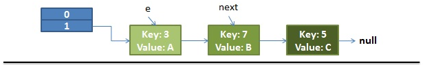
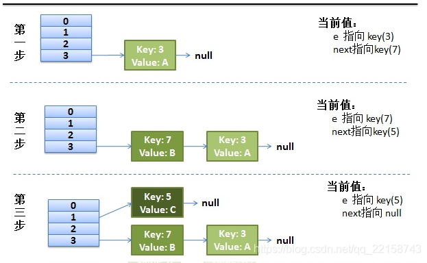

### JAVA集合

### 1. ArrayList 与 LinkedList、Vector

#### 1. ArrayList

1. 非线程安全的，多线程下会发生数据覆盖

2. 实现于 List、RandomAccess 接口。可以插入空数据，支持随机访问

  3. 有两个重要属性：elementData 数组和 size 大小。

  4. elementData 被 `transient`  关键词修饰，防止被自动序列化。ArrayList 自定义了序列化与反序列化，只序列化被使用的数据。

  5. 底层是动态数组，默认大小是 10，扩容是扩展 1.5 倍。

  6. 插入和删除的时间复杂度受元素位置的影响，默认队尾插入O(1)。

  7. 支持快速随机访问，即通过元素的序号快速获取元素对象。

  8. ArrayList 的空间花费 主要体现在列表的结尾会预留一定的容量空间

     > JDK 1.7 是头插法，resize 时，会造成死循环
     >
     > JDK 1.8 是尾插法，resize 时，不会造成死循环 

#### 2. LinkedList

1. 非线程安全的

  2. JDK1.6 之前是循环链表，JDK1.7 之后是双向链表

  3. 不支持快速随机访问

  4. LinkedList 的空间花费体现在他每一个元素都需要消耗比 ArrayLIst 更多的空间，用来存放直接后续和直接前驱。

     > 头插（LinkedList.addFirst()） 和 尾插（LinkedList.addLast()）
     
5. node() 会以 O(n/2) 的性能去获取一个节点

   > 如果索引值大于链表大小的一半，那么尾节点开始遍历

   这样的效率非常低，特别当 index 越接近于中间值时。

#### 3. Vector

1. 线程安全的
2. 底层数组
3. 直接在方法上加锁
4. 扩容是 2 倍

#### 4. RandomAccess

​	RandomAccess 是一个标志接口，表明实现这个接口的 List 集合是支持快速随机访问的。也就是说，实现了这个接口的集合是支持 **快速随机访问** 策略的。

### 2. HashMap 与 ConcurrentHashMap、HashTable

#### 1. HashMap

 1. 非线程安全的

 2. 允许且仅允许一个 key 为 null

 3. 默认大小为 16，负载因子为 0.75，扩容是扩展 2 倍

 4. 底层数据结构

    数组 + 链表 + 红黑树

    当链表长度大于阀值（默认 8）时，将链表转化为红黑树（将链表转化为红黑树之前会先判断，当数组长度小于 64，会选择先进行数组扩容），以减少搜索时间。当红黑树节点数小于 6 时，会退回为链表。

    > **红黑树：**
>
    > 

 5. HashMap的长度为什么是 2 的幂次方

    > Hash 值的范围是 -2^31 ~~ 2^31 - 1，
    >
    > 数组下标的计算方法是 “（n - 1）& hash”

 6. [多线程](https://blog.csdn.net/qq_22158743/article/details/88932176)

    > **JDK 1.7 下：**
    >
    > **数组(Hash) + 链表(Entry)**
    >
    > 并发场景下容易出现死循环：当两个线程同时对原有的旧的 Hash 表进行扩容时，当其中一个线程正在扩容时(遍历单向链表)，CPU 切换到另一个线程进行扩容操作，并且线程二中完成了所有扩容的操作，此时再切换的线程一中，就可能造成单向链表形成一个环，从而下一次查询操作时就有可能发生死循环。
    >
    > HashMap 在扩容时会调用 transfer 方法，就是将原 Hash 表上的元素(Entry)全部转移到新的 Hash 表上，且采用**头插法**。
    >
    > **单线程下 rehash 过程：**
    >
    > **原数据：**
    >
    > 
    >
    > **rehash：**
    >
    > 

    

 7. 遍历方式

    1. 迭代器（Iterator EntrySet）

       ```java
       Iterator<Map.Entry<String, Integer>> entryIterator = map.entrySet().iterator();
       while (entryIterator.hasNext()) {
           Map.Entry<String, Integer> next = entryIterator.next();
           System.out.println("key=" + next.getKey() + " value=" + next.getValue());
       }
       ```

    2. 迭代器（Iterator KeySet）

       ```java
       Iterator<String> iterator = map.keySet().iterator();
       while (iterator.hasNext()){
           String key = iterator.next();
           System.out.println("key=" + key + " value=" + map.get(key));
       }
       ```

    3. For Each（EntrySet）

    4. For Each（KeySet）

    5. Lambda 表达式

       ```java
       map.foreach((k, v) -> {println(k)}});
       ```

    6. Streams API 单线程

       ```java
       map.entrySet().stream.foreach(entry -> {println(entry.getKey())})
       ```

    7. Streams API 多线程

       ```java
       map.entrySet().parallelStream.foreach(entry -> {println(entry.getKey())})
       ```

       


#### 2. ConcurrentHashMap

  1. JDK 1.7

     1. 数据结构

        JDK1.7 以前是采用**分段的数组(Segment) + 链表(HashEntry)**实现

        其中 Segment 继承与 ReentrantLock。

        HashEntry 中的 value 和 next 属性使用 volatile 关键词修饰，保证内存可见性。

     2. 实现线程安全的方式

        整个数组进行了分割分段（Segment），每一把锁只锁其中一部分数据，多线程访问容器里不同数据段的数据不会存在锁竞争。

     3. get 方法

        HashEntry 中的 value 和 next 属性使用 volatile 关键词修饰，保证内存可见性，所以**每次获取值时都是最新值**。

     4. put 方法 

        仍然需要加锁处理。

     5. size 方法

        

  2. JDK1.8 

       1. 数据结构

          采用**数组 + 链表(Node) + 红黑树**实现

          Node 中的 value 和 next 属性使用 volatile 关键词修饰，保证内存可见性。

       2. 实现线程安全的方式

          采用 synchronized 和 CAS 来操作。synchronized 只锁当前链表或红黑树的首节点，只要不hash 冲突，就不会产生并发。

       3. get 方法

          

       4. put 方法

          

       5. size 方法

          

#### 3. HashTable

1. Hashtable 继承自 Dictionary 类，而 HashMap 继承自 AbstractMap 类。

2. 同样基于 hash 表实现，都实现了 Map 接口。也是 k - v 结构。同样通过单链表解决冲突问题。

3. 采用**拉链法**实现哈希表。

   > **table**：为一个 Entry[] 数组类型，Entry 代表了“拉链”的节点，每一个 Entry 代表了一个键值对，哈希表的"key-value 键值对"都是存储在 Entry 数组中的。
   >
   > **count**：HashTable 的大小，注意这个大小并不是 HashTable 的容器大小，而是他所包含 Entry 键值对的数量。
   >
   > **threshold**：Hashtable 的阈值，用于判断是否需要调整 Hashtable 的容量。threshold 的值="容量*加载因子"。
   >
   > **loadFactor**：加载因子。
   >
   > **modCount**：用来实现“fail-fast”机制的（也就是快速失败）。所谓快速失败就是在并发集合中，其进行迭代操作时，若有其他线程对其进行结构性的修改，这时迭代器会立马感知到，并且立即抛出 ConcurrentModificationException 异常，而不是等到迭代完成之后才告诉你（你已经出错了）

	4. 使用 synchronized 修饰
 	5. 哈希值的使用不同，HashTable 直接使用对象的 hashCode。而 HashMap 重新计算 hash 值
 	6. hash 数组默认大小是 11，增加的方式是 old * 2 + 1
 	7. key 和 value 都不允许为 null

#### 4. Collections

 1. 排序

    ```java
    void reverse(List list) // 反转
    void shuffle(List list) // 随机排序
    void short(List list)   // 升序排序
    void swap(List list, int i, int j)   // 交换两个元素的位置
    void rotate(List list, int distance) // 旋转。
    ```

 2. 查找、替换

    ```java
    int binarySearch(List list, Object key) // 对list进行二分查找，返回索引(list 必须是有序的)
    int max(Collection coll)				// 返回最大的元素
    void fill(List list, Object obj)		// ⽤指定的元素代替指定list中的所有元素。
    int frequency(Collection c, Object o)	// 统计元素出现次数
    boolean replaceAll(List list, Object oldVal, Object newVal) // ⽤新元素替换旧元素
    ```

 3. 同步

    ```java
    synchronizedCollection(Collection<T> c) // 返回指定 collection ⽀持的同步（线程安全的） collection。
    synchronizedList(List<T> list)			// 返回指定列表⽀持的同步（线程安全的）List。
    synchronizedMap(Map<K,V> m) 			// 返回由指定映射⽀持的同步（线程安全的）Map。
    synchronizedSet(Set<T> s) 				// 返回指定
    ```

    

#### 5. 快速失败（fail-fast）

​	    快速失败是 Java 集合的一种错误检测机制。

​	    **在使用迭代器对集合进行遍历的时候，我们在多线程下操作非安全失败（fail-safe）的集合类可能就会触发 fail-fast 机制，导致抛出ConcurrentModificationException 异常。另外，单线程下。如果在遍历过程中对集合对象的内容进行了修改操作的话也会触发 fail-fast 机制。**

#### 6. 安全失败（fail-safe）

​	    采⽤安全失败机制的集合容器，在遍历时不是直接在集合内容上访问的，⽽是先复制原有集合内容，在拷⻉的集合上进⾏遍历。所以，在遍历过程中对原集合所作的修改并不能被迭代器检测到，故不会抛ConcurrentModificationException 异常。  


### 3. HashSet

 1. 基于 HashMap 实现

 2. 成员变量

    ```java
    // 用于存放最终数据的。
    private transient HashMap<E,Object> map;
    // 是所有写入 map 的 value 值。
    private static final Object PRESENT = new Object();
    ```

 3. 构造函数

    ```java
    public HashSet() {
    	map = new HashMap<>();
    }
    public HashSet(int initialCapacity, float loadFactor) {
    	map = new HashMap<>(initialCapacity, loadFactor);
    }   
    ```

    

### 4. LinkedHashMap

1. 有序的

   > **排序方式有两种：**
   >
   > 1. 根据写入顺序排序
   > 2. 根据访问顺序排序：每次 get 都会将访问的值移动到链表末尾。

2. 底层是继承于 HashMap 实现，由一个双向链表构成

3. 

4. 数据结构

   ```java
   public class LinkedHashMap<K,V> extends HashMap<K,V> implements Map<K,V>{
   	static class Entry<K,V> extends HashMap.Node<K,V> {
           Entry<K,V> before, after;
           Entry(int hash, K key, V value, Node<K,V> next) {
               super(hash, key, value, next);
           }
       }
       // 指针的 头结点
       private transient Entry<K,V> header;
       // 尾结点
       transient LinkedHashMap.Entry<K,V> tail;
       // 访问顺序
       private final boolean accessOrder;
   }
   ```

5. 构造函数

   ```java
   
   ```

   


### 4. 迭代器


