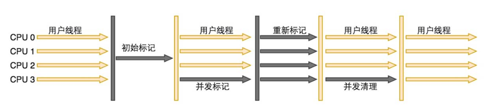
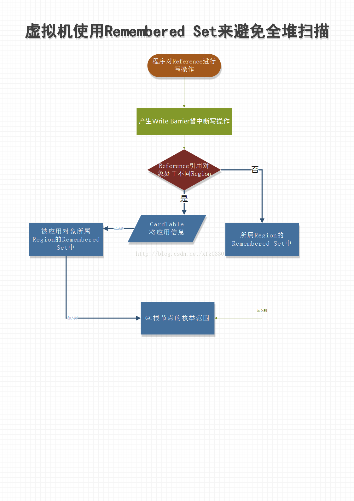

## 一、JVM

### 1. 类装载子系统


### 2. 字节码执行引擎


### 3. JVM 运行时数据区（内存模型）

#### 	1. 虚拟机栈--线程私有

​		a. 每个方法在执行时会创建一个栈帧，存储局部变量，操作数，动态链接，方法返回地址等。

​		b. 每个方法从调用到执行完毕，对应一个栈帧在虚拟机栈中的入栈和出栈。

​		c. 栈帧大小（局部变量）所需内存在编译期间完成分配，方法运行期间不会改变其大小。

​		d. 如果线程请求的栈深度大于虚拟机允许的深度，则 StackOverflowError。

​		e. 如果虚拟机栈可以动态扩展，扩展到无法申请足够的内存，则 OutOfMemoryError。

#### 	2. 本地方法栈--线程私有

​		a. 主要为虚拟机使用到的 Native 方法服务（一个 Native Method 就是一个java调用非java代码的接口）。

#### 	3. 程序计数器--线程私有的

​		a. 是一块很小的内存空间。

​		b. 记录的是虚拟机字节码指令的地址（当前指令的地址）

​		c. 为了线程切换可以恢复到正确的执行位置（一个处理器在一个确定时刻只会执行一个线程，一个线程中包含多条指令）。

#### 	4. 方法区（元数据区）--线程共享

​		a. 被所有方法线程共享的一块内存区域。

​		b. 用于存储类信息、静态变量、常量。

​		c. 这个区域的内存回收目标主要针对常量池和堆类型的卸载

#### 	5. 堆--线程共享

​		a. 堆是 java 虚拟机管理内存最大的一块内存区域

​		b. 用于存放对象实例

### 4. 栈

#### 1. 局部变量表

​	

#### 2. 操作数栈

#### 3. 动态链接

#### 4. 方法出口


​	弹栈 和 压栈

### 5. 堆内存分配

##### 	1. [常用优化设置](https://www.cnblogs.com/leoyang63/articles/12964990.html)

​		-Xmx3550m 

​		-Xms3550m 

​		-Xss256k（虚拟机栈大小）

​		-XX:NewRatio=2（年轻代/年老代=1/2）

​		-XX:SurvivorRatio=8（Sur0/Eden=1/8）

​		-XX:MetaspaceSize=18m（元数据区大小）

​		-XX:MaxMetaspaceSize=60m（元数据区最大大小）

##### 	2. 新生代（1/3）

​		a. Eden （8/10）

​		b. Survivor-from（1/10）

​		c. Survivor-to（1/10）

##### 	3. 老年代（2/3）

##### 	4. 元数据区（直接内存）

### 6. 垃圾标记算法

##### 	1. 引用计数算法

​		a. 通过判断对象的引用数量来决定对象是否可以被回收。

​		b. 每个对象实例都有一个引用计数器，被引用则 +1，完成引用则 -1。

​		c. 引用计数为 0 的对象可以被回收。

​		**优点：**执行效率高，程序执行受影响较小（只需要过滤引用计数为0的对象）。

​		**缺点：**无法检测出循环引用的情况，导致内存泄漏（子对象引用父对象，父对象引用子对象）

##### 	2. 可达性分析算法

​		a. 通过判断对象的引用链是否可达来决定对象是否可以被回收。

​		b. 通过 GC Root 作为起始点，开始向下搜索，搜索所走过的路径被称为引用链。

​		**GC Root：**

​			a. 虚拟机栈中引用的对象（栈帧中的**本地变量表**）

​			b. 方法区中的**常量引用的对象**

​			c. 方法区中的**类静态属性引用的对象**

​			d. 本地方法栈中的JNI（**Native方法**）的引用对象

​			e. 活跃线程的引用对象

### 7. 垃圾回收算法

##### 	1. 标记-清除算法

​		**标记：**从根集合进行扫描，对存活的对象进行标记

​		**清除：**对堆内存进行线性遍历，回收不可达对象内存

​		**缺点：**内存碎片化

##### 	2. 复制算法

​		分为**对象面**和**空闲面**

​		对象在对象面上创建，存活的对象被从对象面复制到空闲面，将对象面所有对象内存清除

​		**优点：**解决了内存碎片化，顺序分配内存，适用于对象存活率低的场景

​		**缺点：**浪费 50% 的内存空间

##### 	3. 标记-整理算法

​		**标记：**从根集合进行扫描，对存活的对象进行标记

​		**清除：**移动所有存活的对象，且按照内存地址次序依次排序，然后将末端内存地址以后的内存全部回收。

​		**优点：**解决了内存碎片化，不用设置两块内存互换，适用于对象存活率高的场景

##### 	4. 分代收集算法

​		按照对象生命周期的不同划分区域采用不同的垃圾回收算法

​		a. **新生代：**MinorGC，采用复制算法，新生对象在 Eden 区

​			当**第一次 **Eden 被占满后，第一次触发 MinorGC，此时，将 Eden中的存活对象复制到 Sur0，并标记对象年龄为 1，清空 Eden。

​			当**第二次** Eden 被占满后，第二次触发 MinorGC，此时，将 Eden 中的存活对象和 Sur0 中的存活对象复制到 Sur1，并标记原 Sur0 对象年龄为 2，原 Eden对象为 1，清空 Eden 和 Sur0。

​			当**第三次** Eden 被占满后，第三次触发 MinorGC，此时，将 Eden 中的存活对象和 Sur1 中的存活对象复制到 Sur0，并标记对象年龄 +1，清空 Eden 和 Sur1。

 			默认对象年龄超过 15 岁时会复制到老年代（-XX:MaxTenuringThreshold=15）。

​		b. **老年代：**FullGC 和 MajorGC，采用标记-清除或标记整理

​		c. **触发 FullGC 的条件**

​			老年代空间不足

​			调用 System.gc()

​			Minor GC 晋升到老年代的平均大小大于老年代的剩余空间

​			CMS GC 时出现 promotion failed（MinorGC 时，Sur 中存放不下，只能存放于老年代，而老年代也放不下），concurrent mode failure（执行CMS GC时，同时有对象需要放入老年代，而老年代没有足够空间）

​			使用 RMI 来进行 RPC 或管理 JDK 应用，每小时执行一次 Full GC

### 8. 垃圾收集器

##### 	1. Stop-the-World

​		JVM 由于要执行 GC 而停止了应用程序的执行

​		任何一种 GC 算法中都会发生

##### 	2. Safepoint

​		当线程运行到这些特定的位置时，线程的一些状态可以被确定，**从而确定 GC Root 的信息**，使 JVM 可以安全的进行一些操作，比如开始 GC。

​		产生 Safepoint 的地方：方法调用，循环跳转，异常跳转

​		安全点数量需要适中

##### 	3. 年轻代：

###### 			a. Serial 收集器（-XX:UseSerialGC，单线程、复制算法）

​			单线程收集，进行垃圾收集时，必须暂停所有工作线程

###### 	b. ParNew 收集器（-XX:UseParNewGC，多线程、复制算法）

​			JVM Client 模式下的默认年轻代收集器

​			多线程收集器，其余的行为、特点和Serail收集器一样

###### 			c. Parallel Scavenge 收集器（-XX:UseParallerGC，多线程、复制算法、高效）

​			JVM Server 模式下的默认年轻代收集器

​			比起前两种关注用户线程的停顿时间，更关注系统的吞吐量（吞吐量=运行代码时间/(运行代码时间+垃圾收集时间)）

##### 	4. 老年代：

###### 			a. Serial Old 收集器（-XX:UseSerialOldGC，单线程、标记-整理算法）

​			JVM Client 模式下的默认老年代收集器

​			单线程收集，进行垃圾收集时，必须暂停所有工作线程

###### 			b. Parallel Old 收集器（-XX:UseParallelOldGC，多线程、标记-整理算法）

​			多线程，吞吐量优先

###### 			c. CMS 收集器（-XX:+UseConcMarkSweepGC，多线程、标记-清除算法）

​			初始标记：标记 GC ROOT 能直接关联到的对象，速度很快。stop-the-world

​			并发标记：判断对象是否与 GC ROOT 有引用链。并发追溯标记，程序不会停顿

​			并发预清理：查找执行并发标记阶段从年轻代晋升到老年代的对象

​			可被终止的预清理：

​			重新标记：修正并发标记期间因用户程序继续运作而导致标记产生变动的那一部分对象的标记记录，扫描CMS堆中的剩余对象。stop-the-world

​			并发清理：清理垃圾对象，程序不会停顿

​			并发重置：重置CMS收集器的数据结构

​	缺点：

​			**因为并发收集，占用了一部分 CPU 资源，导致应用程序变慢**。默认启动垃圾回收线程数量为：(CPU 数量 + 3) / 4，至少占 25% 的资源。

​			**CMS 无法处理浮动垃圾**。由于 CMS 并发清理阶段用户线程仍在运行，伴随着程序运行就会产生垃圾，这些垃圾无法在当次的回收过程中回收，要等到下一次回收（即浮动垃圾）。

​			**基于标记清除算法会产生大量内存碎片**。添加配置优化：-XX:CMSFullGCsBeforeCompaction=10。意思是说在上一次CMS并发GC执行过后，到底还要再执行多少次full GC才会做压缩。默认是0，也就是在默认配置下每次CMS GC顶不住了而要转入full GC的时候都会做压缩。 如果把CMSFullGCsBeforeCompaction配置为10，就会让上面说的第一个条件变成每隔10次真正的full GC才做一次压缩。

​			**remark 阶段优化**：一般 CMS 的 GC 耗时 80% 都在 remark 阶段，添加配置 `-XX:+CMSScavengeBeforeRemark`，在执行 remark 操作之前先做一次 Young GC，目的在于减少年轻代对老年代的无效引用，降低 remark 时的开销



###### 			d. G1 收集器（-XX:+UseG1GC，复制+标记-整理算法），JDK 1.9 默认

​		将整个 Java 堆内存划分为多个大小相同的区域 region，可以有计划的避免在全区域进行垃圾收集。

​		回收方式：跟踪每一个 region 里的垃圾堆积的价值大小（回收所得的空间大小以及所需耗费时间的经验值），维护一个优先列表，每次根据允许的回收时间，优先回收价值最大的 region。

​		region 之间的引用：新生代跟老年代之间的引用根据 remebered set 来避免全盘扫描，每一个 region 都维护一个 remebered set 

​		初始标记（STW）：

​		并发标记：

​		最终标记（STW）：

​		筛选回收：

​	特点：

​		并行和并发：利用多核环境减少停顿时间

​		分代收集：不需要配合其他收集器

​		空间整合：整体上看属于标记整理算法，局部（Region 之间）数据复制算法。运作期间不会产生空间碎片

​		可预测的停顿：

​		**说明：**

​			将整个 JAVA 堆内存划分为多个大小相等的 Region

​			年轻代和老年代不再物理隔离

###### 			e. Epsilon GC 收集器

​				。。。

###### 			f. ZGC 收集器

​			基于**动态Region**内存布局

​			不设年龄分代

​			使用了**读屏障**、**染色指针**和**内存多重映射**等技术来实现**可并发的标记-整理算法**的收集器

​			回收TB级内存（最大4T），停顿时间不超过10ms。

​			**动态Region：**

​				分多个大、中、小三类容量

​				小型Region：每个固定容量为2MB，用于存放小于256KB的小对象

​				中型Region：每个固定容量为32MB，用于存>=256KB，<=4MB的对象

​				大型Region：每个容量不固定，可动态变化，必须是2MB的整数倍，用于存放4MB以上的大对象。

​										每个大型Region中只会存放一个大对象。

​										大型Region在ZGC的实现中是不会被重新分配的，因为复制一个大对象的代价非常高昂。

​			**染色指针技术：**

​					把标记直接记录在对象头上（如Serial收集器）

​					把标记记录在与对象相互独立的数据结构上（如G1收集器）

​					直接把标记记录在引用对象的指针上（如ZGC收集器）

​			**三色标记：**

​					在并发的可达性分析算法中使用三色标记来标记对象是否被收集器访问过。

​					**白色：**表示对象尚未被垃圾收集器访问过。在可达性分析算法的开始阶段，所有的对象都是白色的，在分析结束阶段，仍然是白色的则表示不可达。

​					**黑色：**表示对象已经被垃圾收集器访问过，且这个对象的所有引用都已被扫描过。且表示该对象是安全存活的。

​								如果有其他对象引用指向了黑色对象，无需重新扫描。

​					**灰色：**表示对象已经被垃圾收集器访问过，但这个对象上至少存在一个引用还没有被扫描过。

​					**异常：**

​						 **对象消失理论：**

​							a. 赋值器插入一条或多条从黑色对象到白色对象的新引用

​							b. 赋值器删除了全部从灰色对象到该白色对象的直接或间接引用

​					**解决：**

​						a. 增量更新，将新插入的扫描记录下来，在并发扫描结束后，以记录中的黑色对象为根重新扫描

​						b. 原始快照，将要删除的引用记录下来，在并发扫描结束后，以记录中的灰色对象为根重新扫描

​			**内存多重映射：**

​					将多个不同的虚拟机内存地址映射到同一个物理内存地址上，意味着ZGC在虚拟内存中看到地址空间要比实际的堆内存容量更大

​			**读屏障：**

###### 	g. Shenandoah GC 收集器

​			。。。

### 


#### 9. 卡表


#### 10. OopMap


#### 11. RememberedSet

​	使用 rememberedSet 来避免全堆扫描

​	


## 二、优化

#### 1. [JVM 关于对象分配在堆、栈、TLAB的理解](https://www.cnblogs.com/myseries/p/12884249.html)

##### 1. 逃逸分析：

​        **方法内的对象可以被方法外所访问。**

```java
public class EscapeTest {
	public static Object obj;
	public void globalVariableEscape() {
		// 给全局变量赋值，发生逃逸
		obj = new Object(); 
    }
	public Object methodEscape() {
		// 方法返回值，发生逃逸
		return new Object(); 
    }
	public void instanceEscape() {
	// 实例引用发生逃逸 test(this); 
    }

}

```

##### 2. 栈上分配：

​        **把没发生逃逸的对象，在栈分配空间。**

​        在 Java 应用程序中，很多对象的作用域不会逃逸出方法外，也就是说该对象的**生命周期会随着方法的调用开始而开始，方法的调用的结束而结束**。而对于这种对象，一旦分配到堆空间中，当方法结束，就需要被 GC 回收，对 GC 来说是一种负担。

​		因此，JVM 针对那些**作用域不会逃逸出方法的对象**，在分配内存时不再将对象分配到堆内存中，而是将**对象属性打散后分配在栈上**。这样，随着方法的调用结束，栈空间的回收就会将栈上分配的打散后的对象回收掉，从而减轻 GC 的负担，提升程序的性能。

##### 3. TLAB 分配：

​		**加速对象的分配。**

​		JVM 在堆内存新生代 Eden 区中开辟一小块**线程私有**的区域，称作 TLAB（Thread-local allocation buffer）。默认占用 Eden 区的 1%。

​		在 Java 应用程序中，很多对象都是小对象且用过即丢，他们不存在线程共享且适合被快速 GC，所以对于小对象，JVM 通常会优先分配到 TLAB 上，并且 **TLAB 上的分配是线程私有所以没有锁开销**。因此在实践中分配多个小对象的效率通常比分配一个大对象的效率要高。

##### 4. Java 对象的分配过程

> 1.  编译器通过逃逸分析，确定对象是在栈上分配还是在堆上分配。如果是在堆上分配，则进入选项2.
> 2.  如果 tlab_top + size <= tlab_end，则在在TLAB上直接分配对象并增加 tlab_top 的值，如果现有的 TLAB 不足以存放当前对象则3.
> 3.  重新申请一个 TLAB，并再次尝试存放当前对象。如果放不下，则4.
> 4.  在 Eden 区加锁（这个区是多线程共享的），如果 eden_top + size <= eden_end 则将对象存放在 Eden 区，增加 eden_top 的值，如果 Eden 区不足以存放，则5.
> 5.  执行一次 Young GC（minor collection）。
> 6.  经过 Young GC 之后，如果 Eden 区任然不足以存放当前对象，则直接分配到老年代。

##### 5. 对象内存分配的两种方法

​		**指针碰撞（Serial、ParNew等带Compact过程的收集器）：**假设 堆内存是绝对规整的，所有用过的内存放在一边，空闲的内存放在另一边，中间放着一个指针作为分界点的指示器，那所分配内存就仅仅是把指针向空闲空间方向挪动一段与对象大小相等的距离，这种分配方式被称为“指针碰撞”

​		**空闲列表（CMS这种基于Mark-Sweep算法的收集器）：**如果 堆内存中不是规整的，已使用内存与空闲内存相互交错，那就无法进行简单的指针碰撞了，虚拟机就必须维护一个列表，在分配的时候从列表中找到一块足够大的空间划分给对象实例，并更新列表上的记录，这种分配方式被称为“空闲列表”


## 面试题

### 	1. Java 中的强引用、软应用、弱引用、虚引用

强引用

弱引用

软引用

虚引用

#### 

### 2. GC 调优

一般具体就是通过 GC 日志的情况来分析。

minor GC 频繁：新生代空间太小

full GC 频繁：内存泄漏，大对象频繁


