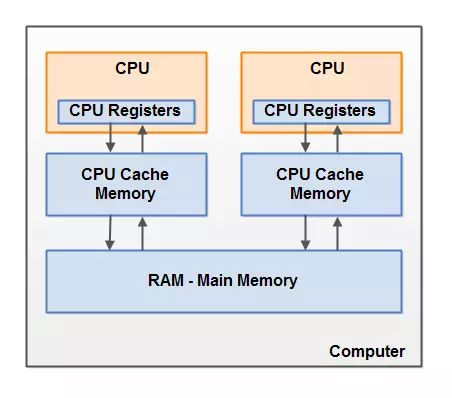

## JMM

Java 内存模型，它是一组规范。

**它主要的目的是解决 由于多线程通过共享内存进行通信时，存在的本地内存数据不一致、编译器会对代码重排序、处理器会对代码乱序执行等 带来的问题。**

可以保证并发编程场景中的原子性、可见性、有序性。

### JVM 对 Java 内存模型的实现

#### 物理 PC 内存模型

**多 CPU：**

**CPU 寄存器：**

**高速缓存：**

**内存：**

#### Java 内存模型

JMM 抽象了主内存和本地内存的概念。
线程之间共享变量存储在主内存中，每个线程都有一个私有的本地内存。本地内存中存储了该线程以 读/写 共享变量的副本。

线程不能直接读写主内存的变量，只能操作自己工作内存中的变量，然后再同步到主内存中。

#### Java 内存模型所带来的问题

**可见性问题：**volatile/synchronized

**竞争现象：**synchronized

#### Java 内存模型的重排序

​	**编译器优化：**编译器（JVM）出于优化的目的，在编译的过程中会出现一定程度的重排。

​	**指令重排序：**CPU 优化行为，和编译器优化很类似，是通过乱序执行的技术，来提高执行效率

​	**内存“重排序”：** **内存系统内不存在重排序**。由于内存有缓存的存在，在 JMM 里表现为主存和本地内存，由于主存和本地内存的不一致，会使得程序表现出乱序的行为。

#### 可见性

**内存可见性：**前一个操作（执行结果）对后一个操作可见，且前一个操作按顺序排在第二个操作之前。

> **Happens-Before的规则包括：**
>
> - 程序顺序原则：在一个线程内一段代码的执行结果是有序的。虽然还会指令重排，但是随便它怎么排，结果是按照我们代码的顺序生成的不会变。
> - 锁规则：无论是在单线程环境还是多线程环境，对于同一个锁来说，一个线程对这个锁解锁之后，另一个线程获取了这个锁都能看到前一个线程的操作结果。
> - volatile变量规则：如果一个线程先去写一个volatile变量，然后一个线程去读这个变量，那么这个写操作的结果一定对读的这个线程可见。
> - 线程启动规则：在主线程A执行过程中，启动子线程B，那么线程A在启动子线程B之前对共享变量的修改结果对线程B可见。
> - 线程结束规则：在主线程A执行过程中，子线程B终止，那么线程B在终止之前对共享变量的修改结果在线程A中可见。
> - 中断规则：线程interrupt()方法的调用比检测线程中断的事件发生的早，可以通过Thread.interrupted()检测到是否发生中断。
> - 终结器规则：一个对象的初始化的完成，也就是构造函数执行的结束一定早于happens-before它的finalize()方法。
> - 传递性：A happens-before B ， B happens-before C，那么A happens-before C。

#### 原子性

简单来说就是一组操作，要么全部执行成功，要么全部执行不成功，不会出现执行一半的情况，是不可风割的。

> **Java 中的原子操作**
>
> - 除 long 和 double 之外的基本类型的赋值操作
> - 所有引用的赋值操作，不管是 32 位机器还是 64 位机器
> - java.concurrent.Atomic.* 包中所有类的原子操作
> - ...
>
> **long 和 double 的原子性**
>
> 在官方文档中，对于 64 位值的写入可以分为两个 32 位的操作进行写入。所以在 32 位上的 JVM，对于 long 和 double 变量的操作就不是原子性的，在 64 位的 JVM 就是原子性的。在商用的虚拟机中，已经将 long 和 double 变量的写入都为原子性的