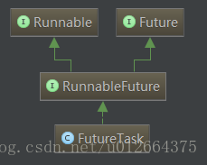

## 线程

1. Thread 

   ```java
   extends Thread;
   ```

2. Runable

   ```java
   interface Runnable {
   　　public abstract void run();
   }
   ```

3. Callable

   ```java
   interface Callable<V> {
   　　V call() throws Exception;
   }
   ```

   > 可以接受泛型，有返回值，可以抛出异常。
   >
   > 获取返回值时，Future.get() 是阻塞的。
   >
   > 生产者与消费者模型，
   

**注：**

Runnable 接口 和 Callable 接口的处理方式都是将其转化为 RunnableFuture



## 多线程

#### 1. 什么是线程

#### 2. 什么是多线程

1. CPU 调度算法

   1. 时间片轮转算法（RR）

      定义一个较小的时间单元（时间片），通常为 10 ~ 100ms；根据先进先出原则排成队列（就绪队列）；调度时，将CPU分配给队首进程，当执行的时间片用完时，会由计时器发出时钟中断请求，调度程序便据此来停止该进程的执行，并将它排到队列队尾，然后再把CPU分配给当前队列的队首进程，同理如此往复。

   2. 优先级调度算法

   3. 先到先服务算法（FCFS）

   4. 最短作业优先调度算法（SJF）

   5. 多级队列调度算法

   6. 多级反馈队列调度算法

2. Java 调度机制

   1. 线程调度器

      > 每个线程都有自己的优先级，但是并不意味着高优先级的线程一定会被调度，而是由 CPU 随机选择的。
      >
      > **抢占式线程调度：**即一个线程在执行自己的任务时，虽然任务还没有执行完，但是 CPU 会迫使他暂停，让其他线程占用该 CPU。
      >
      > **协作式线程调度：**即一个线程在执行自己的任务时，不允许被中途打断，直到任务完毕后才会释放 CPU，其他线程才可以抢占该 CPU。
      >
      > **总结：**
      >
      > Java（JVM层面）在调度机制上采用的是抢占式的线程调度机制。
      >
      > Java（API层面）线程在运行的过程中多个线程之间是协作式的。

3. CPU高速缓存

   1. 

4. 其他

#### 3. 什么是线程安全

”线程安全“不是指线程的安全，而是指内存的安全。

操作系统是多任务的，即多个任务同时运行。为了保证安全，每个进程只能访问分配给自己的内存空间，这是由操作系统保障的。在每个进程的内存空间中都会有一块特殊的公共区域，通常称为堆（内存）。进程内的所有线程都可以访问到该区域，这就是造成问题的潜在原因。

所以线程安全指得是，在堆内存中是数据由于可以被任何线程访问到，在没有限制的情况下存在被意外修改的风险。

#### 4. Volatile

每个线程操作数据时会把数据从主内存读取到自己的工作内存，操作完成后把数据从新写入主内存，这时其他已经读取的线程中的变量副本就会失效，需要对数据进行操作就又要去主存中读取。

1. 缓存一致性

   1. 缓存一致性协议

      > **MSI：**
      >
      > **MESI：**当 CPU 写数据时，如果发现操作的变量是共享变量，会发出信号通知其他 CPU 将该变量设置为无效状态，因此当其他 CPU 读取这个变量时，发现自己缓存中该变量的缓存是无效的状态，就会从内存中重新读取。
      >
      > **MOSI：**
      >
      > **Synapse：**
      >
      > **Firefly：**
      >
      > **DragonProtocol：**

   2. 嗅探

      > 每个处理器通过嗅探在总线上传播的数据来检查自己的缓存是否过期，当处理器发现自己缓存行对应的内存地址被修改，就会将当前处理器的缓存行设置成无效状态。

   3. 总线风暴

      > 缓存一致性需要不断的从主内存嗅探和 CAS，无效的交互会导致总线的带宽达到峰值。

2. 禁止指令重排序

   1. 什么是重排序

      > 为了提高性能，编译器和处理器常常会对既定的代码执行顺序进行指令重排序。
      >
      > 不管怎么重排序，单线程下的执行结果不能被改变。

   2. 重排序的类型

      > 编译器优化重排序：
      >
      > 指令级并行重排序：
      >
      > 内存系统重排序：

   3. 内存屏障

      > cpu 指令

3. volatile

   1. volatile 是怎么保证不会被执行重排序的？

      > **volatile 写操作：**是在前面和后面分别插入内存屏障，禁止上面写和他重排序，禁止下面读和他重排序。
      >
      > **volatile 读操作：**在后面插入两个内存屏障，禁止下面读重排序，禁止下面写重排序。

      > 为了实现volatite的内存语义，JMM会限制特定类型的编译器和处理器重排序，JMM会针对编译器制定volatile重排序规则表。
      >
      > |  是否能重排序  | 第二个操作 |             |             |
      > | :------------: | :--------: | :---------: | :---------: |
      > | **第一个操作** | 普通读/写  | volatile 读 | volatile 写 |
      > |   普通读/写    |            |             |     NO      |
      > |  volatile 读   |     NO     |     NO      |     NO      |
      > |  volatile 写   |            |     NO      |     NO      |

#### 5. Synchroized

1. Java 对象的构成

   1. 对象头

      > **Mark Word（标记字段）：**默认存储对象的 hashCode、分代年龄、锁标志位信息。他会根据自己的状态复用自己的存储空间。也就是说，运行期间，Mark Word 里存储的数据会跟随着锁标记位的变化而变化。
      >
      > | bit fields | 是否偏向锁 | 锁标志位                           |
      > | ---------- | ---------- | ---------------------------------- |
      > | thread id  | 0/1(否/是) | 01/00/10(偏向锁/轻量级锁/重量级锁) |
      >
      > **Klass Point（类型指针）：**对象指向他的元数据的指针，虚拟机通过这个指针来确定这个对象是哪个类的实例。

   2. 实例数据

      > 这部分主要存放类的数据信息，父类的信息

   3. 填充数据

      > 虚拟机要求对象起始地址必须是 8 字节的整数倍，填充数据不是必须存在的，仅仅是为了字节对齐。
      >
      > Tip：空对象默认占 8 字节。

2. Monitor

   监视器，基本元素（临界区、monitor 对象和锁、条件变量以及定义在 monitor 对象上的 wait，signal 操作）

   > 临界区：
   >
   > monitor 对象和锁：
   >
   > 条件变量以及定义在 monitor 对象上的 wait，signal 操作：

3. 有序性

   CPU 会为了优化我们的代码，对我们程序重排序

4. 可见性

   复制主内存副本

5. 原子性

   同一时间，只有一个线程可以拿到锁

6. 可重入性

   synchronized 锁对象的时候有个计数器，他会记录下线程获取锁的次数，在执行完对应的代码块之后，计数器就会 -1，直到计数器清零释放锁。

7. 不可中断性

   一个线程在获取锁之后，另外一个线程处于阻塞或等待状态，前一个不释放，后一个也一直会阻塞或者等待，不可以被中断。
   
8. 使用

   同步代码块：monitorenter、monitorexit，锁是括号里面的对象

   同步普通方法：ACC_SYNCHRONIZED 标识（flag，存放在运行时常量池中的 method_info 结构体中），锁是当前实例对象

   同步静态方法：锁是当前类的 class 对象

#### 6. ReentrantLock

非公平锁加锁过程：判断如果当前 state 为 0，说明当前没有线程占用锁，那么只有一个线程会 CAS 获得锁。那么其他线程会调用 acquire 方法来竞争锁（后续会加到同步队列中自旋或挂起）。当有其他线程 A 进来想要获得锁时，恰好此前的某一线程释放锁，那么 A 会在同步队列中所有等待获取锁的线程之前抢先获得锁。

公平锁加锁过程：所有来的线程必须扔到队列尾部。acquire 方法会向非公平锁一下先调用 tryAcquire 获取锁，但是只有队列为空或者本身就是 head 时，才会成功，如果队列非空则被放到队列尾部

##### 1. [Condition](https://www.cnblogs.com/gemine/p/9039012.html)

​	与 Lock 配合实现**等待/通知**模式。

```java
class DemoLock{
    private Lock lock = new ReentrantLocK();
    private Condition condition = lock.newCondition();
    
    private void conditionWait(){
        lock.lock();
        try{
	        System.out.println("获取锁");
            System.out.println("等待获取信号");
            condition.await();
            System.out.println("获取到信号");
        }catch(Exection ex){
        }finally{
            lock.unlock();
        }
    }
    private void conditionSignal(){
        lock.lock();
        try{
	        System.out.println("获取锁");
            condition.await();
            System.out.println("发出信号");
        }catch(Exection ex){
        }finally{
            lock.unlock();
        }
    }
}

```


#### 7. 信号量（Semaphore）

​		信号量是用来对某一共享资源所能**访问的最大个数**进行控制。	

```java
public class SemaphoreDemo {
    public static void main(String[] args) {
        method_2();
    }
    static void method_2(){
         ExecutorService executorService = Executors.newCachedThreadPool();
        // 信号量，只允许 3个线程同时访问
        Semaphore semaphore = new Semaphore(3);
        for (int i=0;i<10;i++){
            final long num = i;
            executorService.submit(new Runnable() {
                @Override
                public void run() {
                    try {
                        // 获取许可
                        semaphore.acquire();
                        // 执行
                        System.out.println("Accessing: " + num);
                        // 模拟随机执行时长
                        Thread.sleep(new Random().nextInt(5000)); 
                        // 释放
                        semaphore.release();
                        System.out.println("Release..." + num);
                    } catch (InterruptedException e) {
                        e.printStackTrace();
                    }
                }
            });
        }
        executorService.shutdown();
    }
}
```


#### 8. ReadANDWriterLock


#### 9. 锁概念

1. 乐观锁与悲观锁

2. 公平锁与非公平锁

3. 独享锁与共享锁

4. 可重入锁与不可重入锁

5. 偏向锁、轻量级锁、自旋锁与重量级锁

   1. 用户态与内核态

      > 所有的程序都在用户空间运行，进入用户运行状态（即用户态），但是很多操作会涉及内核运行，比如 I/O 。用户态与内核态的切换会消耗大量系统资源。
      >
      > **用户态与内核态的切换：**
      >
      > 。。。

   2. 偏向锁

      > 偏向锁是指一段同步代码一直被一个线程所访问，那么个线程会自动获取锁，降低获取锁定代价。
      >
      > 无竞争条件下，消除整个同步互斥，连 CAS 都不操作

   3. 锁撤销

      > 1. 在一个安全点停止拥有锁的线程
      > 2. 遍历线程栈，如果存在锁记录的话，需要修复锁记录和 Markword，使其变为无锁状态
      > 3. 唤醒当前线程，将当前锁升级为轻量级锁

   4. 锁升级

      > 无锁 -->> 偏向锁 -->> 轻量级锁 -->> 重量级锁

   5. 轻量级锁

      > 轻量级锁是指当锁是偏向锁的时候，被另一个线程访问，偏向锁就会升级为轻量级锁，其他线程会通过自旋的形式尝试获取锁，不会阻塞，提高性能。
      >
      > 无竞争条件下，通过 CAS 消除同步互斥

   6. 自旋锁

      > 当锁被占用时，该线程循环等待，不断的判断锁是否被成功获取，直到获取成功后退出循环
      >
      > 自旋的次数默认为 10 次，可以通过 --XX:PreBlockSpin 来进行设置

   7. 自适应自旋锁

      > 自旋次数不固定

   8. 重量级锁

      > 重量级锁是当锁是轻量级锁时，另一个线程虽然是自旋，单自旋不会一直进行下去，当自旋达到一定的次数，就会进入阻塞，该锁就会膨胀为重量级锁。
      >
      > 升级为重量级锁，会把等待想要获得锁的线程进行阻塞，被阻塞的线程不会消耗 CPU，但是阻塞或者唤醒一个线程需要涉及操作系统操作，即用户态和内核态的切换

6. 锁消除

   1. 不可能存在共享数据竞争的锁进行消除

7. 锁粗化

   1. 扩大加锁的范围，将连续的加锁精简到只加一次锁（StringBuffer 的实现）

#### 10. 中断

#### 11. 线程之间的协作

#### 12. 被弃用的 suspend 和 resume

#### 13. wait 和 notify / notifyAll

#### 14. await 和 signal / signalAll

#### 15. park 和 unpark

#### 16. ThreadLocal

1. ThreadLocalMap

   > 并没有实现 Map 接口，Map 中存储线程本地对象（key）和线程的变量副本（value）
   >
   > **Hash 冲突：**
   >
   > 内部是一个 Entry[ ]，以 hashCode 为下标，当 Hash 冲突时，利用固定的算法寻找一定步长的下个位置（步长加 1 或减 1）。

2. 共享线程的ThreadLocal数据

3. 内存泄漏

   > ThreadLocal的 key 被设置了弱引用，即 key 被 GC 回收了，但是 value 还在。
   >
   > 就比如在线程池里，线程都是副用的，那么之前的线程实例在处理完之后，出于复用目的，线程依然存活，那么这个 Entry 对象中的 value 就有可能一直得不到回收，发生内存泄漏。
   >
   > 按照道理来说，一个线程执行完毕，ThreadLocalMap 应该被清空的，但是现在被复用了。
   >
   > **解决办法：**
   >
   > ​	使用完之后，及时的 threadLocal.remove() ;
   >
   > **为什么 ThreadLocal 的 Key 设置成弱引用？**
   >
   > ​	key 不设置成弱引用的话会造成和 entry 中 value 一样的内存泄漏场景  

#### 17. 线程池

1. 创建方式
2. 四种线程池
3. 队列
4. 丢弃策略

#### 18. JUC-Atomic

#### 19. JUC-AQS

1. 实现原理

   > AQS 内部维护了一个 volailte int state（代表共享资源）和一个 FIFO 线程等待队列（多线程竞争资源被阻塞时进入该队列）。
   >
   > 当 state = 1 时，代表当前对象锁已经被占有
   
2. 为什么需要 AQS

   > 为了封装和抽象，通过封装公共的方法，减少重复代码。


## 面试题

#### 1. synchronized

回答步骤：

​	使用（代码块/普通方法/静态方法）-->> 原理（monitorenter/monitorexit/acc_synchronized）-->> 可重入锁（state ） -->> JDK 8 优化（偏向锁/轻量级锁/重量级锁）

#### 2. synchronized 的了解

#### 3. synchronized 使用

修饰实例方法，对当前实例对象加锁

> acc_synchorized 标志位

修饰静态方法，对当前类的 Class 对象加锁

> 

修饰代码块，对 synchronized 括号内的对象加锁

> monitorenter 和 monitorexit 命令

#### 4. synchronized 底层原理

对象头（Mark Word）锁标志位

方法级同步：通过方法常量池中的方法表结构中的 acc_synchornized 访问标志区分方法是否是同步方法

代码块同步：monitorenter 和 monitorexit 命令

#### 5. synchronized 在 JDK 1.6 之后的优化

偏向锁 -->> 轻量级锁 -->> 重量级锁

#### 6. synchronized 与 ReentrantLock 的区别

synchronized 是关键字，ReentrantLock 是类

synchronized 是非公平锁，ReentrantLock 可设置为公平锁

synchronized 是操作对象头（Mark Word），ReentrantLook 是操作 Unsafe 类的 park() 方法

ReentrantLock 可以设置限时等待，避免死锁（lock.tryLock(long timeout, TimeUnit unit)）

ReentrantLock 可以获取锁定各种信息

ReentrantLock 可以响应中断（调用 interrupt() ）

ReentrantLock 可以实现多路通知

#### 7. volatile


#### 8. JMM 内存模型


#### 9. volatile 与 synchronized 的区别


#### 10. ThreadLocal

1. 原理

   ThreadLocalMap，map 中存储线程本地对象（key）和线程的变量副本（value）

2. 使用

3. 内存泄漏

4. 弱引用

#### 11. 线程池

1. SingleThreadExector

   单线程的线程池

   Executors.newSingleThreadExector();

2. FixedThreadPool

   固定数量的线程池，每提交一个任务创建一个线程，达到最大大小后保持不变

   Exectors.newFixedThreadPool(maxNum);

3. CacheThreadPool

   可缓存的线程池，当线程池的大小超过了处理任务所需的线程，就会回收60秒不活动的线程。任务增加时，再次添加新的线程。

   Exectors.newCacheThreadPool();

4. ScheduledThreadPool

   定时、周期性执行任务

   Exectors.newScheduledThreadPool()

#### 12. ThreadPoolExector

**先增加线程至核心线程数，之后放入队列，队列满则增加线程至最大线程数。**

```java
/**
 * 核心线程数：线程池维护的核心线程数，即使它们处于空闲状态
 * 最大线程数：线程池中允许存在的最大线程数
 * 线程存活时间：超额线程的空闲存活时间
 * 存活时间单位：
 * 缓冲队列：
 * 线程工厂：当需要创建一个新的线程时，使用这个参数来创建
 * 注入的执行处理器（丢弃策略）：当线程阻塞或线程数量达到 workQueue 的上限时，使用这个 handler 来处理
 */
new ThreadPoolExecutor(int corePoolSize, int maximumPoolSize, long keepAliveTime, TimeUnit unit, 
	BlockingQueue<Runnable> workQueue, ThreadFactory threadFactory, RejectedExecutionHandler handler)
```

> **丢弃策略：**
>
> ​	DiscardPolicy：丢弃请求
>
> ​	DiscardOldestPolicy：丢弃队列中最早加入的任务。
>
> ​	AbortPolicy：使用 Executor 抛出异常，通过异常处理。
>
> ​	CallerRunsPolicy：提交任务的线程自己负责执行这个任务。即不会创建新的线程，就在主线程中执行这个任务；
>
> **队列：**
>
> ​	SynchronousQueue：
>
> ​	LinkedBlockingQueue：无界队列
>
> ​	ArrayBlockingQueue：有界队列
>

##### 1. 参数设置：

​	a. tasks，程序每秒需要处理的最大任务数量（假设 100~1000）

​	b. tasktime，单线程处理一个任务所需时间（假设 0.1 秒）

​	c. responsetime，系统允许最大响应时间（假设 2 秒）

**核心数设置：**

线程数 = tasks / (1 / tasktime) = tasks * tasktime

即需要 100 * 0.1 至 1000 * 0.1 ，即大于 10 个，再根据 二八 法则，即可设置为 20。

> CPU 密集型：CPU 核心数 + 1
>
> IO 密集型：CPU 核心数 * 2

**队列的长度：**

队列长度 = (核心线程数 / tasktime) * responsetime

即可设置为 400

 **最大线程数：**

假设每秒 200 个任务，则需要 20 个线程，那么每秒达到 1000 个任务时，则需要 (1000 - 队列长度) * (20 / 200)

即可设置为 60。 


#### 13. 什么是不可变对象，它对写并发应用有什么帮助？


#### 14. 你在多线程环境中遇到的常见的问题是什么？你是怎么解决它的？


#### 15. 多个线程保持 A1 B2 C3 等顺序交替输出

```Java
/**
 * 实现 1，LockSupport
 */
class T1_LockSupport{
    static Thread t1=null,t2=null;
    public static void main(String[] args){
        char[] aI="1234567".toCharArray();
        char[] aC="ABCDEFG".toCharArray();
        
        t1 = new Thread(() -> {
            for(char a : aI){
                System.out.println(a);
                // 唤醒 t2
                LockSupport.unpark(t2);
                // 阻塞 t1
                LockSupport.park();
            }
        }, "t1");
        t2 = new Thread(() -> {
            for(char a : aC){
				// 阻塞 t2, 等待 t1 唤醒
                LockSupport.park();
                System.out.println(a);
                LockSupport.unpark(t1);
            }
        }, "t2");
 		t1.start();
        t2.start();
    }
}

/**
 * 实现 2，synchronized
 */
class T2_Sync{
    public static void main(String[] args) {
        Object o = new Object();
        char[] aI="123456".toCharArray();
        char[] aC="ABCDEF".toCharArray();

        new Thread(() -> {
            synchronized (o){
                for(char a : aI){
                    System.out.println(a);
                    try {
                        o.notify();
                        o.wait();
                    } catch (InterruptedException e) {
                        e.printStackTrace();
                    }
                }
            }
        }, "t1").start();

        new Thread(() -> {
            synchronized (o){
                for(char a : aC){
                    System.out.println(a);
                    try {
                        o.notify();
                        o.wait();
                    } catch (InterruptedException e) {
                        e.printStackTrace();
                    }
                }
            }
        }, "t2").start();
    }
}

/**
 * 实现 3，condition
 */
```

#### 16. ThreadLocal 内存泄漏


#### 17. Synchronized、volatile 的 CPU 原语句实现


#### 18. 多线程间共享数据

1. 全局变量

2. 如果每个线程执行的代码相同，可以将共享变量封装在 Runnable 内部类中

   ```java
   public class DemoRunnable {
       public static void main(String[] args) {
           Ticket t = new Ticket();
           new Thread(t).start();
           new Thread(t).start();
       }
   }
   class Ticket implements Runnable {
       private int ticket = 10;
       public void run() {
           while (ticket > 0) {
               ticket--;
               System.out.println("当前票数为：" + ticket);
           }
       }
   }
   ```

   