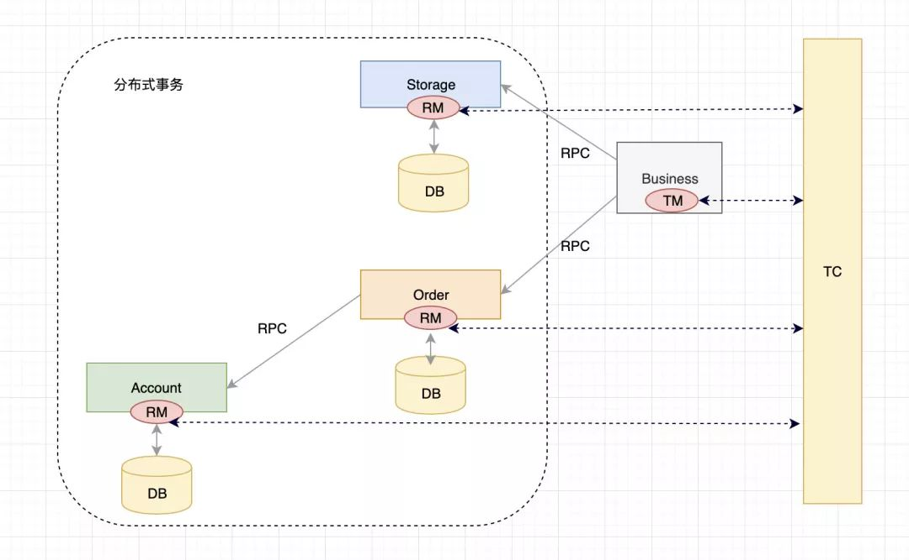
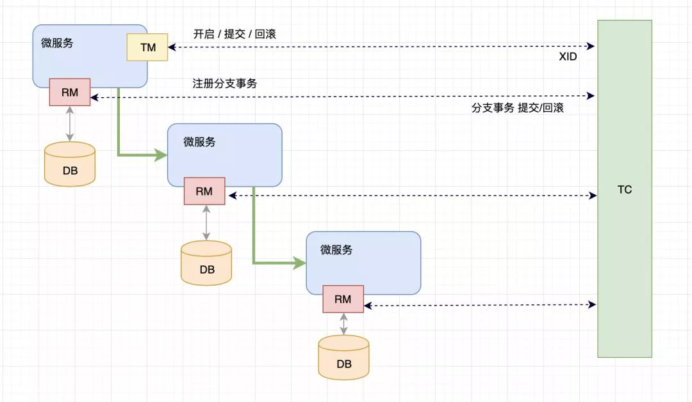

## 一、概述



Business 是业务入口，在程序中会通过**注解**来说明他是一个**全局事务**，这时他的角色为 TM（事务管理者）。

Business 会请求 TC（事务协调器，一个独立运行的服务），说明自己要开启一个全局事务，TC 会生成一个全局事务ID（XID），并返回给 Business。

Business 得到 XID 后，开始调用微服务，例如调用 Storage。

- Storage 会收到 XID，知道自己的事务属于这个全局事务。Storage 执行自己的业务逻辑，操作本地数据库。
- Storage 会把自己的事务注册到 TC，作为这个 XID 下面的一个**分支事务**，并且把自己的事务执行结果也告诉 TC。
- 此时 Storage 的角色是 RM（资源管理者），资源是指本地数据库。
- Order、Account 的执行逻辑与 Storage 一致。
- 在各个微服务都执行完成后，TC 可以知道 XID 下各个分支事务的执行结果，TM（Business） 也就知道了。
- Business 如果发现各个微服务的本地事务都执行成功了，就请求 TC 对这个 XID 提交，否则回滚。
- TC 收到请求后，向 XID 下的所有分支事务发起相应请求。
- 各个微服务收到 TC 的请求后，执行相应指令，并把执行结果上报 TC。

### **1、 重要机制**

（1）全局事务的回滚是如何实现的呢？

Seata 有一个重要的机制：**回滚日志**。

每个分支事务对应的数据库中都需要有一个回滚日志表 UNDO_LOG，在真正修改数据库记录之前，都会先记录修改前的记录值，以便之后回滚。

在收到回滚请求后，就会根据 UNDO_LOG 生成回滚操作的 SQL 语句来执行。

如果收到的是提交请求，就把 UNDO_LOG 中的相应记录删除掉。

（2）RM 是怎么自动和 TC 交互的？

是通过**监控拦截 JDBC** 实现的，例如监控到开启本地事务了，就会自动向 TC 注册、生成回滚日志、向 TC 汇报执行结果。

（3）二阶段回滚失败怎么办？

例如 TC 命令各个 RM 回滚的时候，有一个微服务挂掉了，那么所有正常的微服务也都不会执行回滚，当这个微服务重新正常运行后，TC 会重新执行全局回滚。

### **2、核心组件**

回顾一下其中的**核心组件**：

- 事务协调器 TC

维护全局和分支事务的状态，指示全局提交或者回滚。

- 事务管理者 TM

开启、提交或者回滚一个全局事务。

- 资源管理者 RM

管理执行分支事务的那些资源，向TC注册分支事务、上报分支事务状态、控制分支事务的提交或者回滚。

### 3、具体工作过程



- TM 请求 TC，开始一个新的全局事务，TC 会为这个全局事务生成一个 XID。
- XID 通过微服务的调用链传递到其他微服务。
- RM 把本地事务作为这个XID的分支事务注册到TC。
- TM 请求 TC 对这个 XID 进行提交或回滚。
- TC 指挥这个 XID 下面的所有分支事务进行提交、回滚。


## **二、 Seata 详细工作流程示例**

下面我们通过一个分支事务的执行过程来了解 Seata 的工作流程。

例如有一个业务表 product(id,name)，分支事务的业务逻辑：

> update product set name = 'GTS' where name = 'TXC';

### 1、一阶段

（1）解析 SQL

得到 SQL 的类型（UPDATE），表（product），条件（where name = 'TXC'）等相关的信息。

（2）查询前镜像

根据解析得到的条件信息，生成查询语句，定位数据。

> select id, name from product where name = 'TXC';

得到前镜像：

| ID   | Name |
| ---- | ---- |
| 1    | TXC  |

（3）执行业务 SQL

执行自己的业务逻辑：把 name 改为了 GTS。

> update product set name = 'GTS' where name = 'TXC';

（4）查询后镜像

根据前镜像的结果，通过 主键 定位数据。

> select id, name from product where id = 1;

得到后镜像：

| ID   | Name |
| ---- | ---- |
| 1    | GTS  |

（5）插入回滚日志

把前后镜像数据以及业务 SQL 相关的信息组成一条回滚日志记录，插入到 UNDO_LOG 表中。

（6）提交前，向 TC 注册分支：申请 product 表中，主键值等于 1 的记录的 全局锁 。

（7）本地事务提交：业务数据的更新和前面步骤中生成的 UNDO LOG 一并提交。

（8）将本地事务提交的结果上报给 TC。

### **2、二阶段 - 回滚**

（1）收到 TC 的分支回滚请求，开启一个本地事务，执行如下操作。

（2）通过 XID 和 Branch ID 查找到相应的 UNDO LOG 记录。

（3）数据校验

拿 UNDO LOG 中的后镜与当前数据进行比较，根据校验结果决定是否做回滚。

（4）根据 UNDO LOG 中的前镜像和业务 SQL 的相关信息生成并执行回滚的语句：

```
update product set name = 'TXC' where id = 1;
```

（5）提交本地事务

并把本地事务的执行结果（即分支事务回滚的结果）上报给 TC。

### 3、二阶段 - 提交

（1）收到 TC 的分支提交请求，把请求放入一个异步任务的队列中，马上返回提交成功的结果给 TC。

（2）异步任务阶段的分支提交请求，将异步和批量地删除相应 UNDO LOG 记录。