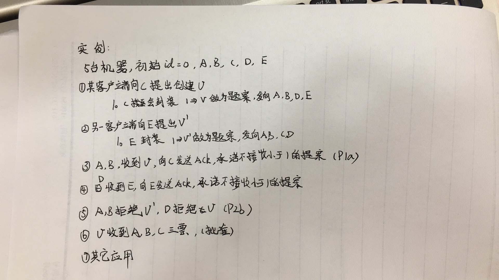
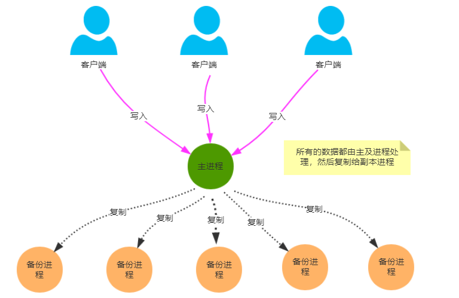

[转载](https://www.jianshu.com/p/40dbe406d2f4)

## 一、概述

#### 1. 为什么需要一致性

1. 数据不能存在单个节点（主机）上，否则可能出现单点故障。
2. 多个节点（主机）需要保证具有相同的数据。
3. 一致性算法就是为了解决上面两个问题。

#### 2. 一致性算法的定义

一致性就是数据保持*一致*，在分布式系统中，可以理解为多个节点中数据的值是一致的。

#### 3. 一致性的分类

- 强一致性

- - 说明：保证系统改变提交以后立即改变集群的状态。

  - 模型：

  - - Paxos
    - Raft（muti-paxos）
    - ZAB（muti-paxos）

- 弱一致性

- - 说明：也叫最终一致性，系统不保证改变提交以后立即改变集群的状态，但是随着时间的推移最终状态是一致的。

  - 模型：

  - - DNS 系统
    - Gossip 协议

#### 4. 一致性算法实现举例

- Google 的 Chubby 分布式锁服务，采用了 Paxos 算法
- etcd 分布式键值数据库，采用了 Raft 算法
- ZooKeeper 分布式应用协调服务，Chubby 的开源实现，采用 ZAB 算法

## 二、Paxos 算法

Paxos 算法是基于**消息传递**且具有**高度容错特性**的**一致性算法**。

### 1. 概念介绍

1. Proposal 提案，即分布式系统的修改请求，可以表示为**[提案编号N，提案内容value]**
2. Client 用户，类似社会民众，负责提出建议
3. Proposer 议员，类似基层人大代表，负责帮Client上交提案
4. Acceptor 投票者，类似全国人大代表，负责为提案投票，**不同意比自己以前接收过的提案编号要小的提案，其他提案都同意**，例如A以前给N号提案表决过，那么再收到小于等于N号的提案时就直接拒绝了
5. Learner 提案接受者，类似记录被通过提案的记录员，负责记录提案

### 2. 算法流程

#### 2.1 prepare 阶段

- proposer 选择一个提案编号 N 并将 prepare 请求发送给 acceptors 中的一个多数派；
- acceptor 收到 prepare 消息后，如果提案的编号大于它已经回复的所有 prepare 消息(回复消息表示接受 accept)，则 acceptor 将自己上次接受的提案回复给 proposer，并承诺不再回复小于 n 的提案；

#### 2.2 批准阶段

当一个 proposer 收到了多数 acceptors 对 prepare 的回复后，就进入批准阶段。**它要向回复 prepare 请求的 acceptors 发送 accept 请求，包括编号 N 和根据 P2c 决定的 value （如果根据 P2c 没有已经接受的 value，那么它可以自由决定 value）**。
 在不违背自己向其他 proposer 的承诺的前提下， acceptor 收到 accept 请求后即批准这个请求。

这个过程在任何时候中断都可以保证正确性。例如如果一个 proposer 发现已经有其他 proposers 提出了编号更高的提案，则有必要中断这个过程。因此为了优化，在上述 prepare 过程中，如果一个 acceptor 发现存在一个更高编号的提案，则需要通知 proposer，提醒其中断这次提案。

实例如下：

### 3 Paxos 总结

- 在一个决议提议的过程中，其他决议会被否决。如上 `E` 的提议被否决，不会被应用，意味着更多的网络 IO，意味着更多的冲突。
- 每一个服务器都可以作为提议者或者接收者
- 不保证决议的顺序性

## 三、Raft

### 1. 概念介绍

Raft 是用于管理复制日志的一致性算法，raft 协议也是一个**主备模型**，有一个唯一的 `leader` 控制任务的提交。

1. Leader 总统节点，负责发出提案
2. Follower 追随者节点，负责同意 Leader 发出的提案
3. Candidate 候选人，负责争夺 Leader

### 2. 算法流程

#### 2.1 Leader 选举过程

#### 2.2 数据同步过程

### 3. Raft 总结

## 四、Zookeeper（ZAB）

### 1. 概念介绍

对于 `paxos` 来说，每一个议案都要经过不同节点的提出，并且讨论，在提出一个议案的阶段，另外的提议会被否决，导致了性能的低下。

ZAB 协议是为分布式协调服务 `Zookeeper` 专门设计的一种支持 **崩溃恢复** 和 **原子广播** 协议。

基于该协议，`Zookeeper` 实现了一种 **主备模式** 的系统架构来保持集群中各个副本之间数据一致性。具体如下图所示：

### 2. 算法流程

#### 2.1. 消息广播

ZAB 协议的消息广播过程使用的是一个原子广播协议，类似一个 **二阶段提交过程**。对于客户端发送的写请求，全部由 Leader 接收，Leader 将请求封装成一个事务 Proposal，将其发送给所有 Follwer ，然后，根据所有 Follwer 的反馈，如果超过半数成功响应，则执行 commit 操作（先提交自己，再发送 commit 给所有 Follwer）。

**基本上，整个广播流程分为 3 步骤：**

1. 将数据都复制到 Follwer 中
2. 等待 Follwer 回应 Ack，最低超过半数即成功
3. 当超过半数成功回应，则执行 commit ，同时提交自己

实际上，在 Leader 和 Follwer 之间还有一个消息队列，用来解耦他们之间的耦合，避免同步，实现异步解耦。

**还有一些细节：**

1. Leader 在收到客户端请求之后，会将这个请求封装成一个事务，并给这个事务分配一个全局递增的唯一 ID，称为事务ID（ZXID），ZAB 兮协议需要保证事务的顺序，因此必须将每一个事务按照 ZXID 进行先后排序然后处理。
2. 在 Leader 和 Follwer 之间还有一个消息队列，用来解耦他们之间的耦合，解除同步阻塞。
3. zookeeper集群中为保证任何所有进程能够有序的顺序执行，只能是 Leader 服务器接受写请求，即使是 Follower 服务器接受到客户端的请求，也会转发到 Leader 服务器进行处理。
4. 实际上，这是一种简化版本的 2PC，不能解决单点问题。等会我们会讲述 ZAB 如何解决单点问题（即 Leader 崩溃问题）。

#### 2.2. 崩溃恢复

假设1：Leader 在复制数据给所有 Follwer 之后崩溃，怎么办？

假设2：Leader 在收到 Ack 并提交了自己，同时发送了部分 commit 出去之后崩溃怎么办？

**针对这些问题，ZAB 定义了 2 个原则：**

1. ZAB 协议确保那些已经在 Leader 提交的事务最终会被所有服务器提交。
2. ZAB 协议确保丢弃那些只在 Leader 提出/复制，但没有提交的事务。

所以，ZAB 设计了下面这样一个选举算法：**能够确保提交已经被 Leader 提交的事务，同时丢弃已经被跳过的事务。**

针对这个要求，如果让 Leader 选举算法能够保证新选举出来的 Leader 服务器拥有集群总所有机器编号（即 ZXID 最大）的事务，那么就能够保证这个新选举出来的 Leader 一定具有所有已经提交的提案。
而且这么做有一个好处是：**可以省去 Leader 服务器检查事务的提交和丢弃工作的这一步操作。**

#### 2.3. 数据同步

​		当崩溃恢复之后，需要在正式工作之前（接收客户端请求），Leader 服务器首先确认事务是否都已经被过半的 Follwer 提交了，即是否完成了数据同步。目的是为了保持数据一致。

​		当所有的 Follwer 服务器都成功同步之后，Leader 会将这些服务器加入到可用服务器列表中。

​		实际上，Leader 服务器处理或丢弃事务都是依赖着 ZXID 的，那么这个 ZXID 如何生成呢？

​		答：在 ZAB 协议的事务编号 ZXID 设计中，ZXID 是一个 64 位的数字，其中低 32 位可以看作是一个简单的递增的计数器，针对客户端的每一个事务请求，Leader 都会产生一个新的事务 Proposal 并对该计数器进行 + 1 操作。

​		而高 32 位则代表了 Leader 服务器上取出本地日志中最大事务 Proposal 的 ZXID，并从该 ZXID 中解析出对应的 epoch 值，然后再对这个值加一。

​		高 32 位代表了每代 Leader 的唯一性，低 32 代表了每代 Leader 中事务的唯一性。同时，也能让 Follwer 通过高 32 位识别不同的 Leader。简化了数据恢复流程。

​		基于这样的策略：当 Follower 链接上 Leader 之后，Leader 服务器会根据自己服务器上最后被提交的 ZXID 和 Follower 上的 ZXID 进行比对，比对结果要么回滚，要么和 Leader 同步。

### 3. ZAB 总结

- Zk 集群中的 `client` 和任意一个节点建立 `TCP` 长连接，完成所有的交互动作（虽然所有的交互都是 节点转发到 `leader`）
- Zk 中的读请求，直接由连接的节点处理，不需要经过 `leader`，**这种模式可能导致读取到的数据是过时的，但是可以保证一定是半数节点之前确认过的数据**。
- Zk 有 `sync()` 方法，可以保证读取到最新的数据。

## 五、Gossip

### 1. 概念介绍

## 六、NWR

### 1. 概念介绍

**`NWR` 是一种在分布式存储系统中用于控制一致性级别的一种策略。在 `Amazon` 的 `Dynamo` 云存储系统中，就应用 `NWR` 来控制一致性。**

让我们先来看看这三个字母的含义：

- N：在分布式存储系统中，有多少份备份数据

- W：代表一次成功的更新操作要求至少有 `w` 份数据写入成功

- R： 代表一次成功的读数据操作要求至少有R份数据成功读取

  NWR 值的不同组合会产生不同的一致性效果，当 `W+R>N` 的时候，整个系统对于客户端来讲能保证强一致性。当 W+R 以常见的 N=3、W=2、R=2 为例：

  - `N=3`表示，任何一个对象都必须有三个副本（`Replica`），`W=2` 表示，对数据的修改操作（`Write`）只需要在 3 个 `Replica` 中的 2 个上面完成就返回，`R=2` 表示，从三个对象中要读取到2个数据对象，才能返回。

在分布式系统中，**数据的单点是不允许存在的**。即线上正常存在的 `Replica`数量是 1 的情况是非常危险的，因为一旦这个 `Replica` 再次错误，就 可能发生数据的永久性错误。假如我们把 N 设置成为 2，那么，只要有一个存储节点发生损坏，就会有单点的存在。所以 N 必须大于 2。N约高，系统的维护和整体 成本就越高。工业界通常把 N 设置为3。
 当 W 是 2、R 是 2 的时候，`W+R>N`，这种情况对于客户端就是强一致性的。

在具体实现系统时，仅仅依靠 `NWR` 协议还不能完成一致性保证，因为在上述过程中，当读取到多个备份数据时，需要判断哪些数据是最新的，如何判断数据的新旧？这需要向量时钟来配合，所以对于 `Dynamo` 来说，是通过NWR协议结合向量时钟来共同完成一致性保证的。