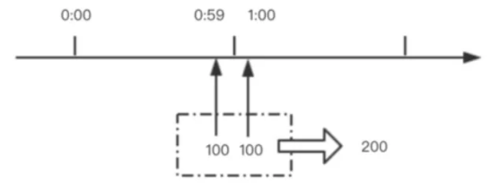

## 一、[简述](https://www.cnblogs.com/duanxz/p/4123068.html)

​	

## 二、限流算法

### 1. 计数器

​		计数器法是限流算法里最简单也是最容易实现的一种算法。比如我们规定，对于A接口来说，我们1分钟的访问次数不能超过100个。那么我们我们可以设置一个计数器counter，其有效时间为1分钟（即每分钟计数器会被重置为0），每当一个请求过来的时候，counter就加1，如果counter的值大于100，就说明请求数过多；
​		这个算法虽然简单，但是有一个十分致命的问题，那就是临界问题。

​		如上图所示，在1:00前一刻到达100个请求，1:00计数器被重置，1:00后一刻又到达100个请求，显然计数器不会超过100，所有请求都不会被拦截；然而这一时间段内请求数已经达到200，远超100。违背定义的固定速率。

### 2. 令牌桶

​	令牌桶算法：一个存放固定容量令牌的桶，按照固定速率（每秒/或者可以自定义时间）往桶里添加令牌，然后每次获取一个令牌，当桶里没有令牌可取时，则拒绝服务。令牌桶分为2个动作，动作1(固定速率往桶中存入令牌)、动作2(客户端如果想访问请求，先从桶中获取token)

> **流入：**以固定速率从桶中流入水滴
> **流出：**按照任意速率从桶中流出水滴
>
> **优点：**支持大的并发，有效利用网络带宽

​		令牌桶算法，放在服务端，用来保护服务端（自己），主要用来对调用者频率进行限流，为的是不让自己被压垮。所以如果自己本身有处理能力的时候，如果流量突发（实际消费能力强于配置的流量限制=桶大小），那么实际处理速率可以超过配置的限制（桶大小）。

> 1. 假如用户配置的平均发送速率为 r，则每隔 1/r 秒一个令牌被加入到桶中；
>   2. 假设桶最多可以存发 b 个令牌。如果令牌到达时令牌桶已经满了，那么这个令牌会被丢弃；
>   3. 当一个 n 个字节的[数据包](https://baike.baidu.com/item/数据包)到达时，就从令牌桶中删除 n 个令牌，并且数据包被发送到网络；
>   4. 如果令牌桶中少于 n 个令牌，那么不会删除令牌，并且认为这个数据包在流量限制之外；

### 3. 漏桶

​		漏桶算法：水（请求）先进入到漏桶里，漏桶以一定的速度出水，当水流入速度过大会直接溢出（拒绝服务），可以看出漏桶算法能强行限制数据的传输速率

> **流入：**以任意速率往桶中放入水滴。
> **流出：**以固定速率从桶中流出水滴。
>
> **缺点：**因为当流出速度固定，大规模持续突发量，无法多余处理，浪费网络带宽
> **优点：**无法击垮服务
>
> 用白话具体说明：假设漏斗总支持并发100个最大请求，如果超过100个请求，那么会提示系统繁忙，请稍后再试，数据输出那可以设置 1 个线程池，处理线程数 5 个，每秒处理 20 个请求。

​		漏桶(Leaky Bucket)算法思路很简单，水(请求)先进入到漏桶里，漏桶以一定的速度出水(接口有响应速率)，当水流入速度过大会直接溢出(访问频率超过接口响应速率)，然后就拒绝请求，而当入小于出的情况下，漏桶不起任何作用。可以看出漏桶算法能强行限制数据的传输速率。

​		注意：在我们的应用中，漏桶算法强制限定流量速率后，多出的（溢出的）流量可以被利用起来，并非完全丢弃，我们可以把它收集到一个队列里面，做流量队列，尽量做到合理利用所有资源。

​		漏桶算法，放在调用方，这是用来保护他人，也就是保护他所调用的系统。主要场景是，当调用的第三方系统本身没有保护机制，或者有流量限制的时候，我们的调用速度不能超过他的限制，由于我们不能更改第三方系统，所以只有在主调方控制。这个时候，即使流量突发，也必须舍弃。因为消费能力是第三方决定的。

### 4. 滑动时间窗口：

### 5. 三色速率标记法：

## 三、限流实现

### 1. RateLimiter简介(guava的令牌桶实现）

​		Google 开源工具包 Guava 提供了限流工具类 RateLimiter，该类基于令牌桶算法(Token Bucket)来完成限流，非常易于使用。RateLimiter 经常用于限制对一些物理资源或者逻辑资源的访问速率。它支持两种获取 permits 接口，一种是如果拿不到立刻返回 false，一种会阻塞等待一段时间看能不能拿到。原理见《[guava--RateLimiter源码分析](https://www.cnblogs.com/duanxz/p/14659528.html)》

RateLimiter 和 Java 中的信号量(java.util.concurrent.Semaphore)类似，Semaphore 通常用于限制并发量.

### 2. 基于 redis 的分布式限流

### 3. SpringCloudGateWay + RequestRateLimiter

### 4. [AOP + Semaphore](https://www.cnblogs.com/duanxz/p/4489364.html)