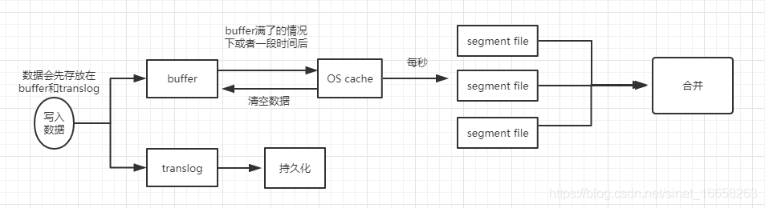

## 一、ElasticSearch分布式架构原理

### 1. shard（分片）与 replica（复制）机制

#### 1.1 分片（shards）

​		在一个搜索里存储的数据，潜在的情况下可能会超过单个节点的硬件的存储限制，为了解决这个问题，ElasticSearch 便提供了分片的功能，它可以将索引划分为多个分片，当你创建一个索引的时候，你就可以简单的定义你想要的分片的数量，每一个分片本身是一个全功能的完全独立的索引，可以部署到集群中的任何一个节点。分片的两个总要原因：

（1）它允许你水平切分你的内容卷

（2）它允许通过分片来分布和并执行操作来应对日益增长的执行量

#### 1.2 复制（replica）

​		在一个网络情况下，故障可能会随时发生，有一个故障恢复机制是必须的，为了达到这个目的，ES 允许你制作一个或多个拷贝放入一个叫做复制分片或短暂的复制品中。复制对于以下两个主要原因很重要

（1）高可用。它提供了高可用的以来防止分片或者节点宕机，为此，一个非常重要的注意点就是绝对不要讲一个分片的拷贝放在跟这个分片相同的机器上。

（2）高并发。它允许你的分片可以提供超出自身吞吐量的搜索服务，搜索行为可以在分片所有的拷贝中并行执行。

​		总之，一个完整的流程就是，ES 客户端将一份数据写入 primary shard，它会将分成成对的 shard 分片，并将数据进行复制，ES 客户端取数据的时候就会在 replica 或 primary shard 中去读。ES 集群有多个节点，会自动选举一个节点为 master 节点，这个 master 节点其实就是干一些管理类的操作，比如维护元数据，负责切换 primary shard 和 replica shard 的身份之类的，要是 master 节点宕机了，那么就会重新选举下一个节点为 master 为节点。如果时非 master 宕机了，那么就会有 master 节点，让那个宕机的节点上的 primary shard 的身份转移到 replica shard 上，如果修复了宕机的那台机器，重启之后，master 节点就会控制将缺失的 replica shard 分配过去，同步后续的修改工作，让集群恢复正常。

> **Primary Shard（主分片）**
>
> Primary Shard可以将索引的数据分散到多个Data Node上， 实现存储的水平扩展，主分片个数在索引创建的时候指定，后续默认不可更改，如果要更改，必须重建索引。
>
> **Replica Shard（副本分片）**
>
> Replica Shard的引入是为了提高数据可用性。一旦主分片丢失，副本分片可以晋升到主分片。副本分片可以动态调整的。副本分片可以服务于读请求，因此通过增加副本分片可以提升系统的整体吞吐量。

#### 1.3 小结

> （1）一个 index 包含多个 shard，也就是**一个索引存在多个服务器上**
>
> （2）每个 shard 都是一个最小工作单元，承载部分数据，比如有三台服务器，现在有三条数据，这三条数据在三台服务器上各放一条
>
> （3）增减节点时，shard 会自动在 nodes 中负载均衡
>
> （4）primary shard 和 replica shard，每个 document 肯定只存在于某一个 primary shard 以及其对应的 replica shard 中，不可能存在于多个 primary shard
>
> （5）replica shard 是 primary shard 的副本，负责容错，以及承担读请求负载
>
> （6）primary shard 的数量在创建索引的时候就固定了，replica shard 的数量可以随时修改
>
> （7）primary shard 的默认数量是 5，replica 默认是 1，默认有 10 个 shard，5 个 primary shard，5 个 replica shard
>
> （8）primary shard 不能和自己的 replica shard 放在同一个节点上（否则节点宕机，primary shard 和副本都丢失，起不到容错的作用），但是可以和其他 primary shard 的 replica shard 放在同一个节点上
>

### 2. 容错机制

在集群中会有一个 master 负责当 leader 进行协调，比如上图的 Node2 为 master, 那么当它挂了的时候会重现选举一个新的 master，比如新选举的是 Node3，这个时候 replica 2 这时候会变成 primary。

当 Node2 恢复了的时候，这个时候 node2 的 primary 会变成 replica

### 3. ES 写入数据的过程

> 1. 客户端选择一个 node 发送请求过去，这个 node 就是 coordinating node (协调节点)
> 2. coordinating node，对 document 进行路由，将请求转发给对应的 node
> 3. 实际上的 node 上的 primary shard 处理请求，然后将数据同步到 replica node
> 4. coordinating node，如果发现 primary node 和所有的 replica node 都搞定之后，就会返回请求到客户端
>
> 这个路由简单的说就是取模算法,比如说现在有3太服务器,这个时候传过来的id是5,那么5%3=2,就放在第2太服务器

#### 3.1 写入数据底层原理：



> 1. 数据先写入到 buffer 里面，在 buffer 里面的数据是搜索不到的；同时将数据写入到 translog 日志文件之中
> 2. 如果 buffer 快满了，或是一段时间之后(定时)，就会将 buffer 数据 refresh 到一个新的 OS cache 之中，然后每隔 1 秒，就会将 OS cache 的数据写入到segment file 之中，但是如果 buffer 之中此时没有数据，就会创建一个新的空的 segment file，只要 buffer 中的数据被 refresh到 OS cache 之中，就代表这个数据可以被搜索到了。当然可以通过 restful api 和 Java api，手动的执行一次 refresh 操作，就是手动的将 buffer 中的数据刷入到 OS cache 之中，让数据立马搜索到，只要数据被输入到 OS cache 之中，buffer 的内容就会被清空了。同时进行的是，数据到 shard 之后，就会将数据写入到 translog 之中，每隔 5 秒将 translog 之中的数据持久化到磁盘之中
> 3. 重复以上的操作，每次一条数据写入 buffer，同时会写入一条日志到 translog 日志文件之中去，这个 translog 文件会不断的变大，当达到一定的程度之后，就会触发 commit 操作。
> 4. 将一个 commit point 写入到磁盘文件，里面标识着这个 commit point 对应的所有 segment file
> 5. 强行将 OS cache 之中的数据都 fsync 到磁盘文件中去。
>    解释：translog 的作用：在执行 commit 之前，所有的数据都是停留在 buffer 或 OS cache 之中，无论 buffer 或 OS cache 都是内存，一旦这台机器死了，内存的数据就会丢失，所以需要将数据对应的操作写入一个专门的日志问价之中，一旦机器出现宕机，再次重启的时候，es 会主动的读取 translog 之中的日志文件的数据，恢复到内存 buffer 和 OS cache 之中。
> 6. 将现有的 translog 文件进行清空，然后在重新启动一个 translog，此时 commit 就算是成功了，默认的是每隔 30 分钟进行一次 commit，但是如果 translog 的文件过大，也会触发 commit，整个 commit 过程就叫做一个 flush 操作，我们也可以通过 ES API，手动执行 flush 操作，手动将 OS cache 的数据 fsync 到磁盘上面去，记录一个 commit point，清空 translog 文件
>    补充：其实 translog 的数据也是先写入到 OS cache 之中的，默认每隔 5 秒之中将数据刷新到硬盘中去，也就是说，可能有 5 秒的数据仅仅停留在 buffer 或者 translog 文件的 OS cache 中，如果此时机器挂了，会丢失 5 秒的数据，但是这样的性能比较好，我们也可以将每次的操作都必须是直接 fsync 到磁盘，但是性能会比较差。
> 7. 如果是删除操作，commit 的时候会产生一个 .del 文件，里面讲某个 doc 标记为 delete 状态，那么搜索的时候，会根据 .del 文件的状态，就知道那个文件被删除了。
> 8. 如果是更新操作，就是将原来的 doc 标识为 delete 状态，然后重新写入一条数据即可。
> 9. buffer 每次更新一次，就会产生一个 segment file 文件，所以在默认情况之下，就会产生很多的 segment file 文件，将会定期执行 merge 操作
> 10. 每次 merge 的时候，就会将多个 segment file 文件进行合并为一个，同时将标记为 delete 的文件进行删除，然后将新的 segment file 文件写入到磁盘，这里会写一个 commit point，标识所有的新的 segment file，然后打开新的 segment file 供搜索使用。

### 4. ES 查询过程

#### 4.1 倒排序算法

通过分词把词语出现的 id 进行记录下来，再查询的时候先去查到哪些 id 包含这个数据,然后再根据id把数据查出来。

> 

#### 4.2 查询过程

> 1. 客户端发送一个请求给 coordinate node（协调节点）
> 2. 协调节点将搜索的请求转发给所有的 shard 对应的 primary shard 或 replica shard
> 3. query phase：每一个shard 将自己搜索的结果（其实也就是一些唯一标识），返回给协调节点，有协调节点进行数据的合并，排序，分页等操作，产出最后的结果
> 4. fetch phase ，接着由协调节点，根据唯一标识去各个节点进行拉去数据，最总返回给客户端

#### 4.3 查询原理

查询过程大体上分为查询和取回这两个阶段，广播查询请求到所有相关分片，并将它们的响应整合成全局排序后的结果集合，这个结果集合会返回给客户端。

> - 查询阶段
>   1. 当一个节点接收到一个搜索请求，这这个节点就会变成协调节点，第一步就是将广播请求到搜索的每一个节点的分片拷贝，查询请求可以被某一个主分片或某一个副分片处理，协调节点将在之后的请求中轮训所有的分片拷贝来分摊负载。
>   2. 每一个分片将会在本地构建一个优先级队列，如果客户端要求返回结果排序中从from 名开始的数量为size的结果集，每一个节点都会产生一个from+size大小的结果集，因此优先级队列的大小也就是from+size，分片仅仅是返回一个轻量级的结果给协调节点，包括结果级中的每一个文档的ID和进行排序所需要的信息。
>   3. 协调节点将会将所有的结果进行汇总，并进行全局排序，最总得到排序结果。
>
> - 取值阶段
>   1. 查询过程得到的排序结果，标记处哪些文档是符合要求的，此时仍然需要获取这些文档返回给客户端
>   2. 协调节点会确定实际需要的返回的文档，并向含有该文档的分片发送get请求，分片获取的文档返回给协调节点，协调节点将结果返回给客户端

### 5. 更新过程

#### 5.1 document 的全量替换

全量是把数据找出来，然后在 Java 代码中进行修改，再放回去。

partial 是直接提交需要修改的字段然后直接修改，在一个 shard 中进行，内部也是全量替换。

> 1. 这个就是用新的数据全部覆盖以前的数据
> 2. 重新创建一个document并把原来的标记为delete
> 3. partial update, 就是制定需要更新的字段. 

### 6. 删除过程

当要进行删除 document 的时候，只是把它标记为 delete，当数据到达一定的时候再进行删除, 有点像 JVM 中标记清除法

## 二、Es并发解决方案

### 1. 解决方案-悲观锁

在读取商品数据时，同时对这一行数据加锁，当此线程处理完数据之后，再解锁，另一个线程开始处理。

悲观锁并发控制方案，就是在各种情况下，都上锁。上锁之后，就只有一个线程可以操作这一条数据，不同的场景之下，上的锁不同，行级锁，表级锁，读锁，写锁。

### 2. 解决方案-乐观锁

乐观锁不加锁，每个线程都可以任意操作。es 的每条文档中有一个 \_version 字段，新建文档后为1，修改一次累加，线程 A，B 同时读取到数据，\_version=1，A处理完之后库存为 99，在写入 es 的时候会跟 es 中的版本号比较，都是 1，则写入成功，\_version=2，B处理完之后也为 99，存入 es 时与 es 中的数据的版本号 \_version=2 相比，明显不同，此时不会用 99 去更新，而是重新读取最新的数据，再减一，变为 98，执行上述操作，写入。

### 3. Elasticsearch的乐观锁

Elasticsearch 的后台都是多线程异步的，多个请求之间是乱序的，可能后修改的先到，先修改的后到。

Elasticsearch 的多线程异步并发修改是基于自己的 _version 版本号进行乐观锁并发控制的。

在后修改的先到时，修改完毕后，当先修改的后到时，会比较一下 _version 版本号，如果不相等就直接扔掉，不需要了。这样结果会就会保存为一个正确状态。

> 删除操作也会对这条数据的版本号加 1
>
> 在删除一个 document 之后，可以从一个侧面证明，它不是立即物理删除掉的，因为它的一些版本号等信息还是保留着的。先删除一条 document，再重新创建这条 document，其实会在 delete version 基础之上，再把 version 号加 1。

### 4. 基于 external version 进行乐观锁并发控制

es 提供了一个 feature，就是说，你可以不用它提供的内部 _version 版本号来进行并发控制，可以基于你自己维护的一个版本号来进行并发控制。

```java
?version=1&version_type=external
```

version_type=external，唯一的区别在于，\_version，只有当你提供的 version 与 es 中的 \_version 一模一样的时候，才可以进行修改，只要不一样，就报错; 当version_type=external 的时候，只有当你提供的 version 比 es 中的 \_version 大的时候，才能完成修改

es，\_version=1，?version=1，才能更新成功
es，\_version=1，?version>1&version_type=external，才能成功，比如说 ?version=2&version_type=external

