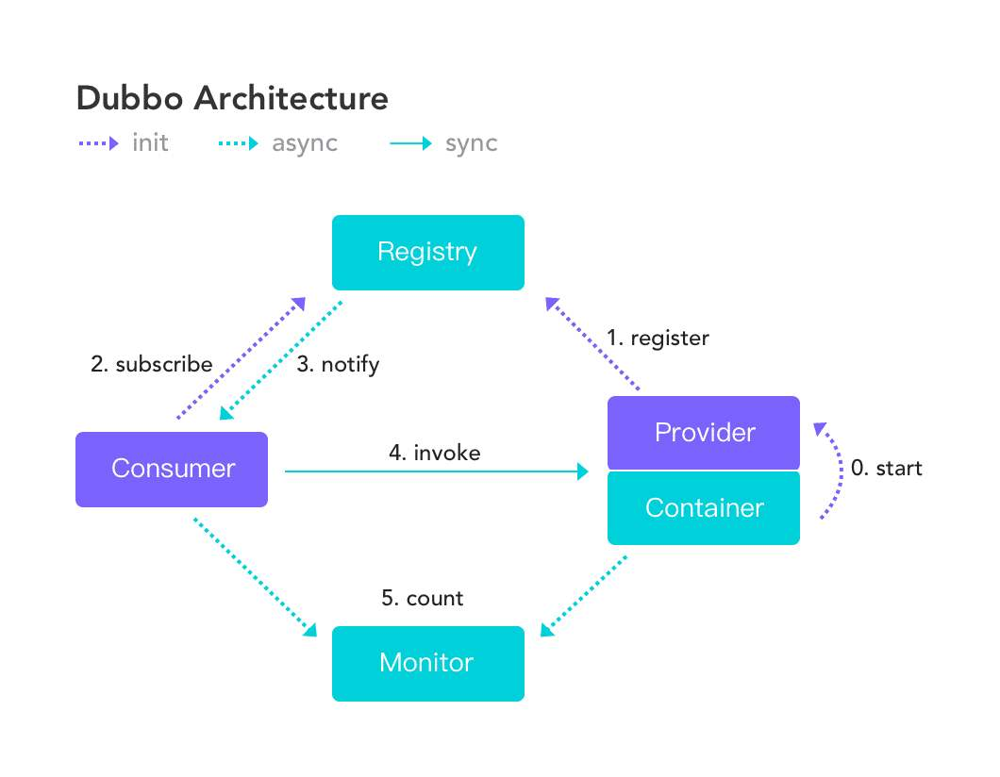
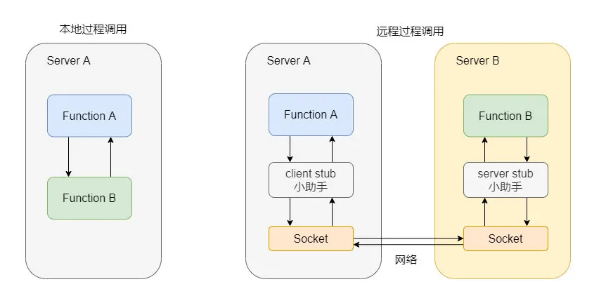

## Dubbo 核心领域模型

> **Protocol：** 服务域，它是 Invoker 暴露和引用的主功能入口，负责 Invoker 的生命周期管理。
>
> **Invoker：**实体域，它是 dubbo 的核心模型。其它模型都向他靠拢，或转化成它。它代表一个**可执行体**，可向他发起 invoke 调用。它有可能是一个本地的实现，也有可能是一个远程的实现，也有可能是一个集群的实现。在服务提供方，Invoker用于调用服务提供类。在服务消费方，Invoker用于执行远程调用。
>
> **invocation：**会话域，它持有调用过程中的变量，比如方法名、参数等。

## [Dubbo 基本的原理](https://mp.weixin.qq.com/s/FPbu8rFOHyTGROIV8XJeTA)

0. **start：**启动容器，相当于启动 dubbo 的 provider，并且会创建对应的目录结构，如 com.learnDubbo.demo.DemoService，就会创建 /dubbo/com.learnDubbo.demo.DemoService 目录，然后在创建 providers 目录，再在 providers 目录下写入自己的 URL 地址。
1. **register：**启动后会去注册中心进行注册，注册所有可以提供的服务列表。即订阅 com.learnDubbo.demo.DemoService 目录下的所有提供者和消费者 URL 地址。
2. **subscribe：**consumer 在启动时，不仅仅会注册自身到 ../consumers/ 目录下，同时还会订阅 ../providers/ 目录，实时获取其上 provider 的 URL 字符串信息。当服务消费者启动时：会在 /dubbo/com.learnDubbo.demo.DemoService 目录下创建 /consumers 目录，并在 /consumers 目录下写入自己的 url 地址。
3. **notify：**当 provider 有修改后，注册中心会把消息推送给 consumer。也就是注册中心会对 provider 进行观察。
4. **[invoke](https://blog.csdn.net/FrankChina/article/details/51474866)：**根据获取到的 provider 地址，真实调用 provider 中的功能。这里就是唯一一个同步的方法，因为消费者要得到生产者传来的数据才能进行下一步操作。
5. **monitor：**consumer 和 provider 每隔一分钟向 monitor 发送统计消息，统计消息包含**访问次数、频率**等。

### 1. RPC 远程过程调用

本地过程调用：简单的说就是本机上内部的方法调用都可以称为本地过程调用。

远程过程调用：指的是本地调用了远程机子上的某个方法，其实现可以走 HTTP，也可以是基于 TCP 的自定义协议。

### 2. 服务消费者

首先，消费者面向接口编程，所以需要得知有哪些接口可以调用，公用 jar 包的方式来维护接口

其次，具体的实现，即框架。实现代理类，使得消费者只管调用，无需处理其他。这个代理需要知道调用的是哪个方法，参数值等。

再次，注册中心，使得调用方可以知晓有哪些服务提供方可提供调用。

第四，集群部署，负载均衡策略。

第五，容错机制，如重试等。

第六，调用协议，

第七，序列化格式，

第八，Filter，用作统一处理，如调用计数等。

### 3. 服务提供者

### 4. 注册中心

### 5. 监控运维

## Dubbo 通信协议

## [Dubbo SPI 机制](https://mp.weixin.qq.com/s/gwWOsdQGEN0t2GJVMQQexw)

## [服务的暴露过程](https://mp.weixin.qq.com/s/ISiN06QynyE2pPtX3cGQ9w)

服务的暴露起始于 Spring IOC 容器刷新完毕之后，会根据配置参数组装成 URL，然后会根据 URL 的参数来进行本地或远程调用。

会通过 proxyFactory.getInvoker，利用 javassist 来进行动态代理，封装真的实现类，然后在通过 URL 参数选择对应的协议来进行 protocol.export，默认是 dubbo 协议。

在第一次暴露的时候会调用 createServer 来创建 Server，默认是 NettyServer。

然后将 export 得到的 exporter 存入一个 Map 中，供之后的远程调用查找，然后会向注册中心注册提供者的信息。

## [服务的引入流程](https://mp.weixin.qq.com/s/9oDy1OPcfDaEhKD4eNUdOA)

服务的引入时机有两种，一种是饿汉式，一种是懒汉式（默认）。

饿汉式就是**加载完毕**就会引入，懒汉式就是**当这个服务被注入到其他类中时**启动引入流程。

会先根据配置参数组装成 URL。一般而言，我们都会配置注册中心，所以，会构建 RedistryDirectory 向注册中心注册消费者的信息，并且订阅提供者、配置、路由等节点。

得知提供者的信息之后会进入 dubbo 协议的引入，会创建 Invoker，期间会包含 NettyClient，来进行远程通信，最后会通过 Cluster 来包装 Invoker，默认是 FailoverCluster，最终返回代理类。 

## [服务的调用流程](https://mp.weixin.qq.com/s/oNR9v_ID2oAlEvDI93hRcw)

调用某个接口的方法，会调用之前生成的代理类，然后会从 cluster 中经过路由的过滤、负载均衡机制选择一个 invoker 发起远程调用，此时会记录此请求与请求的 ID等待服务端的响应。

服务端接收请求之后会通过参数找到之前暴露存储的 map， 得到相应的 exporter，然后调用真正的实现类，再组装好结果返回，这个响应会带上之前请求的 ID。

消费者收到响应之后会通过 ID 去找之前记录的请求，然后找到请求之后将响应塞到对应的 future 中，唤醒等待的线程。最后消费者得到响应，一个流程完毕。

## [Dubbo 集群容错负载均衡](https://mp.weixin.qq.com/s/-IkHNAM4B0R_j50LkQunig)

## [如何设计一个 RPC 框架](https://mp.weixin.qq.com/s/FwL6qArqYc2ENymXk1eZFQ)

