## 服务引入大致流程

已经得知，Provider 将自己服务暴露出来，注册到注册中心。而 Consumer 无非是通过一系列操作总注册中心得知 Provider 信息，然后自己封装一个调用类和 Provider 进行深入的交流。

在 Dubbo 中一个可执行体就是 Invoker，所有调用都向 Invoker 靠拢。因此，可以推断出应该要先生成一个 Invoker，然后又因为框架要往不侵入业务代码的方向靠拢，那 Consumer 需要无感知的调用远程接口，因此需要搞一个代理类，包装一下屏蔽底层的细节。

大致流程如下：

## 服务引入的时机

和服务的暴露一样，也是通过 Spring 自定义标签机制解析生成对应的 Bean，**Provider Service 对应解析的是 ServiceBean，Consumer Reference 对应的是 ReferenceBean**。

服务引入的时机有两种，一种是 饿汉式，一种是懒汉式。

饿汉式是通过 Spring 的 InitializingBean 接口中的 afterPropertiesSet 方法，容器通过调用 ReferenceBean 的 afterPropertiesSet 方法时引入服务。

懒汉式是只有当这个服务被注入到其他类中时启动引入流程，也就是说用到了才会开始服务引入。

**默认情况下，Dubbo 使用懒汉式引入服务**，如果需要使用饿汉式，可通过配置 dubbo:reference 的 init 属性开启。

## 服务引入的三种方式

服务的引入又分为了三种，第一种是本地引入、第二种是直接连接引入远程服务、第三种是通过注册中心引入远程服务。

**本地引入：**之前服务暴露的流程每个服务都会通过搞一个本地暴露，走 injvm 协议，因为存在一个服务端既是 provider 又是 consumer 的情况，然后有可能自己会调用自己的服务，因此弄了一个本地引入，避免远程网络调用的开销。所以**服务引入会先去本地缓存找找看有没有本地服务**。

**直连远程引入服务：**这个其实就是平日测试的情况下用用，不需要启动注册中心，由 Consumer 直接配置写死 Provider 的地址，然后直连即可。

**注册中心引入远程服务：**这个就是重点了，Consumer 通过注册中心得知 Provider 的相关信息，然后进行服务的引入，这里还包括多注册中心，同一个服务多个提供者的情况，如何抉择如何封装，如何进行负载均衡、容错并且让使用者无感知等。

## 服务引入流程解析

默认是懒汉式的，服务引入的入口就是 ReferenceBean 的 getObject() 方法。

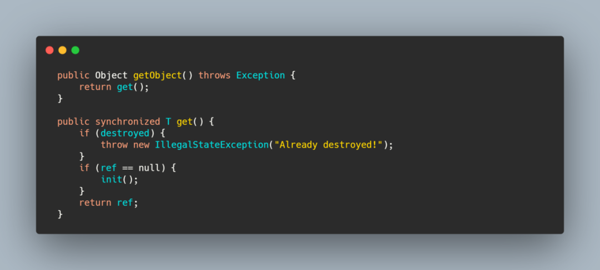

可以看到很简单，就是调用 get 方法，如果当前还没有这个引用那么就执行 init 方法。

## 源码分析

### 大致流程

init() 方法很长，大部分是检查配置然后将配置构建成 map。以下直接看一下构建完的 map。

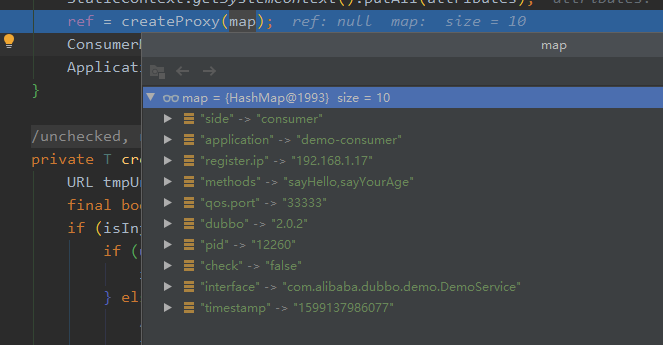

然后就进入重点方法 createProxy，从名字可以得到就是要创建的一个代理。

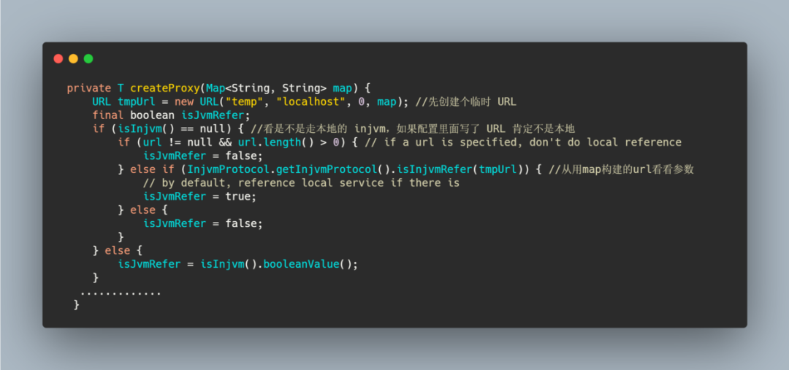

如果是走本地的话，就直接构建一个本地协议的 URL 然后进行服务的引入。即 refprotocol.refer。本地引入就是去之前服务暴露的 exporterMap 拿到服务，这里就不深究了。

如果不是本地就是远程了，就下来就是判断是点对点直连 provider 还是通过注册中心拿到 provider 信息再连接 provider 了。如果配置了 URL 那么不是直连的地址，就是注册中心的地址。

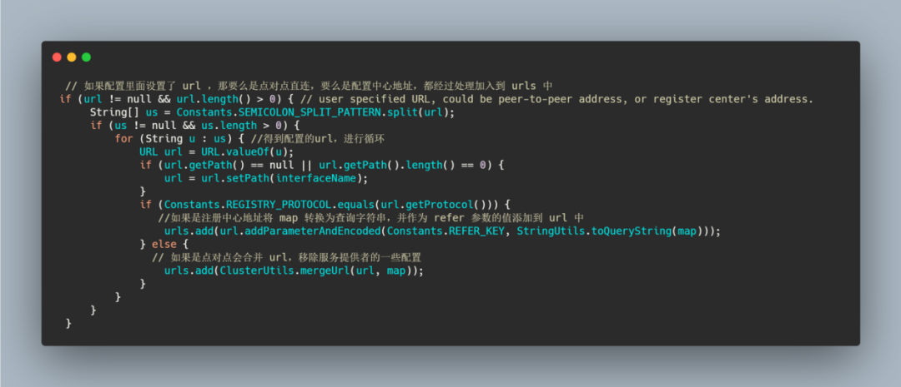

然后就是没配置 url 的情况，到这里肯定走的就是注册中心引入远程服务了。

最终拼接出来的 URL 长这样。

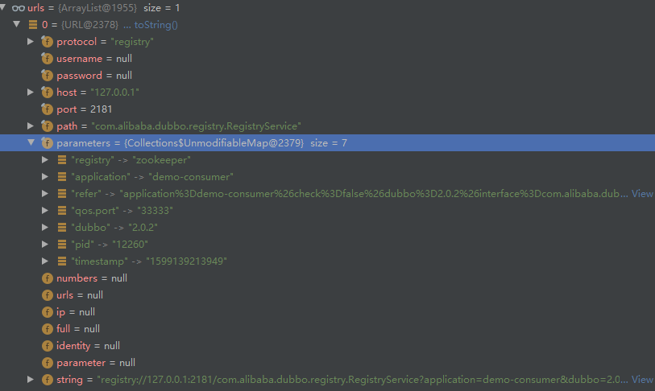

可以看到这一部分其实就是根据各种参数来组装 URL ，因为我们的自适应扩展都需要根据 URL 的参数来进行的。

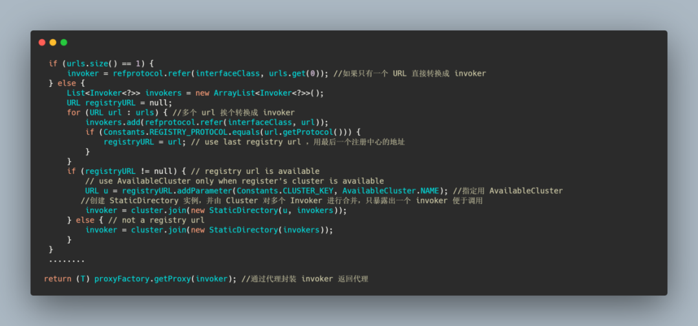

捋一下

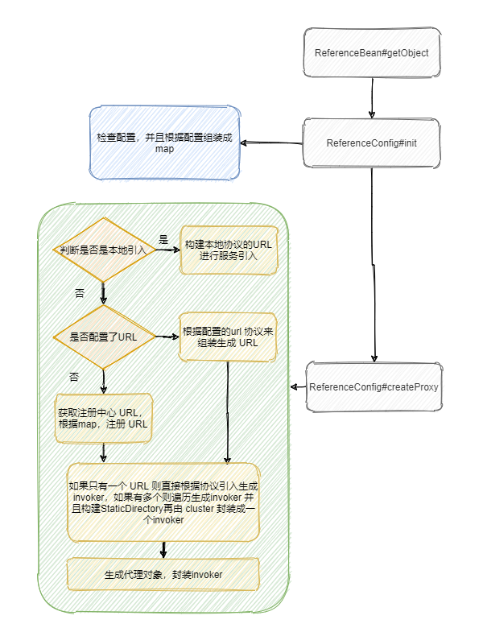

这其实就是整个流程了，简述一下就是先检查配置，通过配置构建一个 map，然后利用 map 来构建 URL，再通过 URL 上的协议利用自适应扩展调用对应的 protocol.refer 得到相应的 invoker。

在有多个 URL 的时候，先遍历构建出 invoker，然后再由 StaticDirectory 封装一下，然后通过 cluster 进行合并，只暴露出一个 invoker。

然后在构建代理，封装 invoker 返回服务引用，之后 Consumer 调用的就是这个代理类。

### 细节 

通过上图和上面总结性的简述已经知道大致的服务引入流程了，不过还是有很多细节，比如如何从注册中心得到 Provider 的地址，invoker 里面到底是怎么样的？

从前面的截图我们可以看到此时的协议是 registry 因此走的是 RegistryProtocol#refer，我们来看一下这个方法。

主要就是获取注册中心实例，然后调用 doRefer 进行真正的 refer。

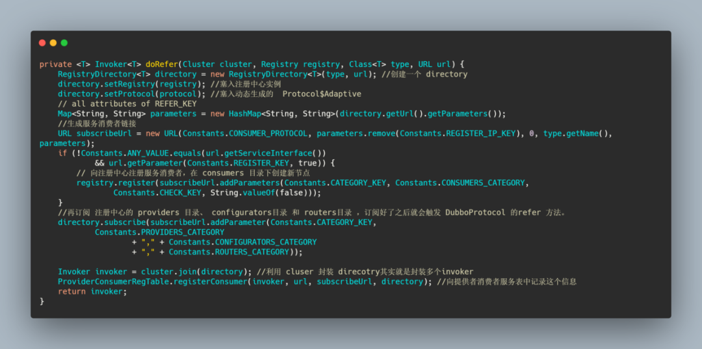

这个方法很关键，可以看到生成了一个 **RegistryDirectory** 这个 directory 塞了注册中心实例。它自身也实现了 NotifyListener 接口，因此**注册中心的监听其实就是靠这个实现的**。

然后向注册中心注册自身的信息，并且向注册中心订阅 providers 节点、configurators 节点和 routers 节点，**订阅了之后 RegistryDirectory 会收到这几个节点下的信息就会触发 DubboInvoker 的生成，即用于远程调用的 Invoker。 **

然后再通过 cluster 再包装一下得到 Invoker，因此一个服务可能会有多个提供者，最终在 ProviderConsumerRegTable 中记录这些信息，然后返回 Invoker。

所以我们知道，Consumr 是在 RegisretProtocol#refer 中向注册中心注册自己的信息，并且订阅 Provider 和配置的一些相关信息。如下，是订阅返回的信息。

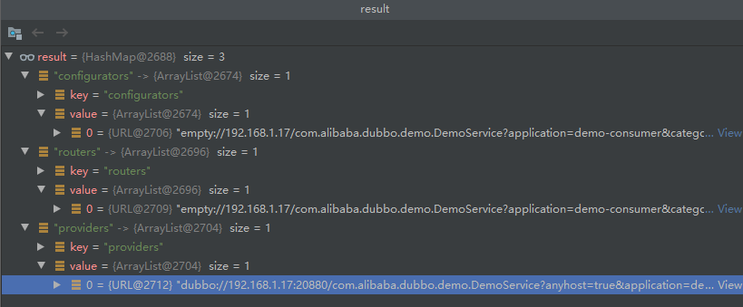

拿到 Privder 的信息之后就可以通过监听触发 DubboProtocol#refer 了（具体调用哪个 Protocol 还是得看 URL 的协议）。调用栈如下。

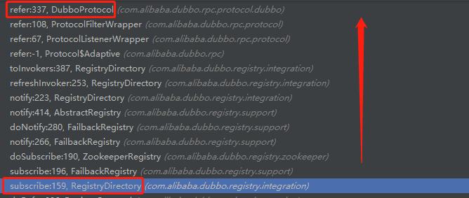

终于从注册中心拿到远程 provider 的信息了，然后进行服务的引入。

这里的重点是 getClients，因为终究是要跟远程服务进行网络调用的，而 getClients 就是用于获取客户端实例，实例类型为 exchangeClient，底层依赖 netty 来进行网络通信，并且可以看到默认是共享连接。

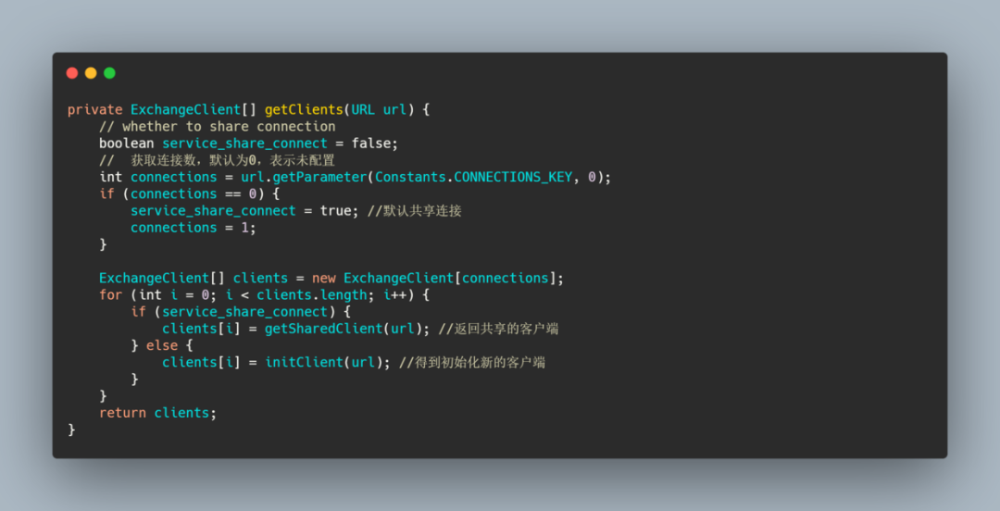

getSharedClient 就不分析了，就是通过远程地址找 client ，这个 client 还有引用计数的功能，如果该远程地址还没有 client 则调用 initClient，来看一下 initClient 方法。

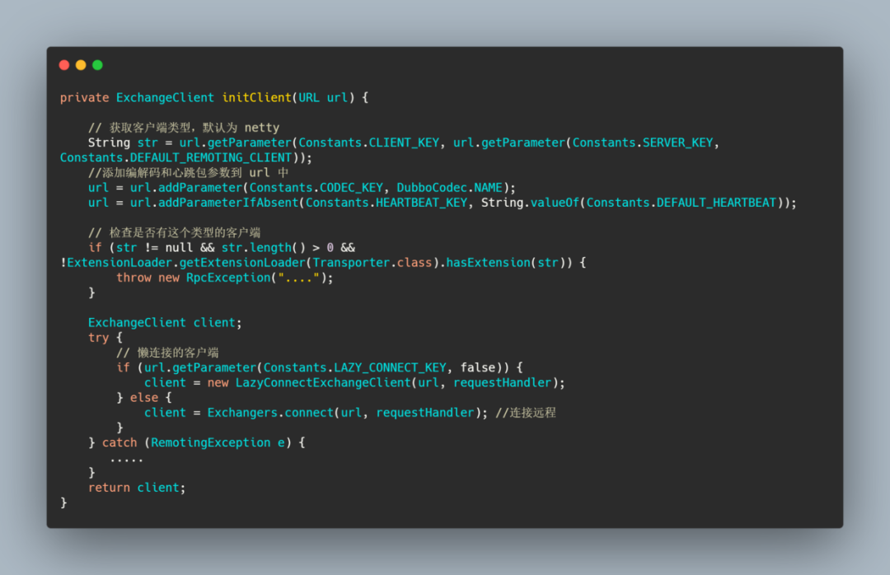

而这个 connect 最终返回 `HeaderExchangeClient` 里面封装的是 `NettyClient`。

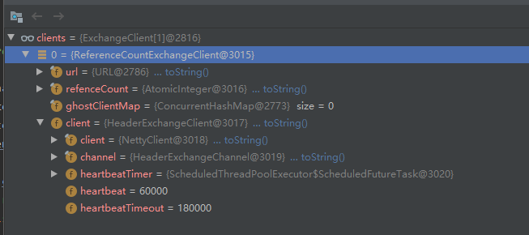

然后最终得到的 `Invoker` 就是这个样子，可以看到记录的很多信息，基本上该有的都有了，我这里走的是对应的服务只有一个 url 的情况，多个 url 无非也是利用 `directory` 和 `cluster` 再封装一层。

最终将调用 `return (T) proxyFactory.getProxy(invoker);` 返回一个代理对象。

### 小结

总结的说，无非就是通过配置组成 URL，然后通过 SPI 自适应得到对应的实现类进行服务引入，如果是注册中心那么会向注册中心注册自己的信息，然后订阅注册中心的相关信息得到远程 provider 的 IP 等信息，再通过 netty 客户端进行连接。

并且通过 directory 和 cluster 进行底层多个服务提供者的屏蔽、容错和负载均衡等，最终得到封装好的 invoker 再通过动态代理封装得到代理类，让接口调用者无感知的调用方法。 

