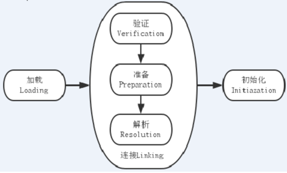
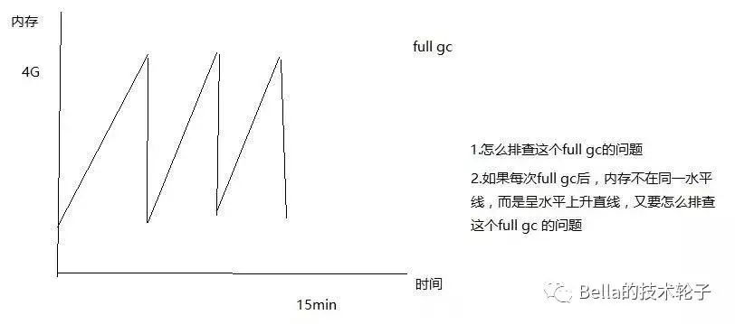
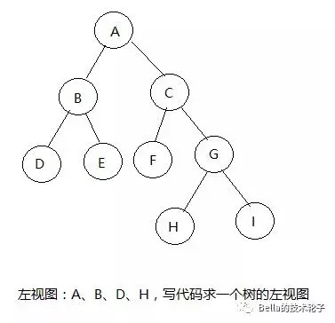
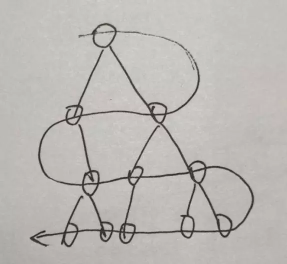
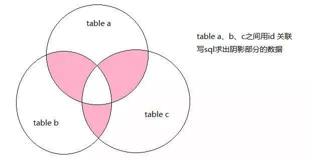
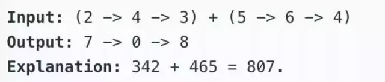

### Spring

#### 1. 如何理解 Spring 中的 AOP 和 IOC/DI

**AOP: **面向切面编程，即把业务逻辑功能抽取出来，然后动态把这个功能注入到需要的方法中，这样从业务角度上看，AOP 达到了更进一步的解耦。

AOP 使用**横切**技术，把系统分为两个部分：**核心关注点**和**横切关注点**。业务处理的流程为核心关注点，与之关系不大的为横切关注点（如 权限认证，日志，事务处理）。

AOP 相关术语：

​	通知（Advice）：

​	切入点（JoinPoint）：

​	切入点（Pointcut）：

​	切面（Aspect）：

​	引入（introduction）：

​	目标（target）：

​	代理（proxy）:

​	织入（weaving）：

**IOC/DI：**控制反转/依赖注入

> 在 A 类中调用 B 类的方法，即 A 依赖 B，B 为被依赖对象。
>
> **传统做法：**
>
> (1) 直接在 A（方法）中 new 出 B 对象，然后调用 B 类的方法
>
> (2) 通过简单工厂获取 B 类对象，然后调用 B 类的方法 -- 摆脱了与 B 的耦合，却又与工厂产生了耦合
>
> **Spring 框架：**
>
> 在 Spring 中 B 的实例对象被看作 Bean 对象，这个 Bean 对象是由 Spring 容器进行创建和管理，Spring 会通过配置文件自动执行在 A 中对 B 对象的 setter 方法（即 A 中需要有对 B 对象的 setter 方法），如此，A 获取 B 的实例对象就不是由自己主动去获取，而是被动接受 Spring 给它设值，那么，这个主动变为被动，就可以理解为**控制反转**。 
>
> 从spring容器的角度上看，它负责把A的依赖对象B（B是被依赖对象）注入给了A，所以我们可以理解为**依赖注入**

#### 2. spring bean 的创建时间

> ​	对于 Spring BeanFactory，由于他的应用场合（内存或其他资源受限的场合），使用了延迟加载机制，只有在用户 getBean() 方法时，使用的 JavaBean 实例才会被创建。
>
> ​	对于 Spring ApplicationContext，一旦 ContextLoaderServlet 或者 ContextLoaderListener 初始化成功，所有的类型为 singleton，非延时加载的 JavaBean 实例将会被创建，prototype 类型的 JavaBean 和使用了延迟加载的 singleton 类型的 bean 在使用 getBean 方法时被创建。
>
> ​	实现了 BeanPostProcessor 接口的类会在容器启动的时候初始化。  

#### 3. spring 运行时修改 redis 的密码

> BeanPostProcessor 后置处理器

#### 4. spring cloud Config、动态修改配置文件


#### 5. spring cloud Eureka 服务暴露过程


#### 6. spring cloud Eureka 服务注册与发现的流程


#### 7. spring cloud Hystrix 断路器

##### 1. hystrix 功能  


##### 2. hystrix 怎么检测断路器是否要开启/关闭 

**断路器开启：**

1. 整个链路达到一定的阀值，默认情况下，10 秒内达到 20 个请求
2. 请求的错误百分比大于阀值，默认 50%

**断路器关闭：**

​	1. 断路器打开后，在一段时间内，命令不会再执行（一直触发回退），这段时间被称为“休眠期”（默认 5 秒）。“休眠期”结束后， Hystrix 会尝试性执行一次命令，如果执行成功，则关闭断路器并清空链路信息；如果执行失败。断路器则继续保持打开状态。

##### 3. hystrix 实现原理

1. 使用命令模式将所有对外部服务（或依赖关系）的调用包装在 HystrixCommand 或 HystrixObservableCommand 对象中，并将该对象放在单独的线程中执行；
2. 每个依赖都维护着一个线程池（或信号量），线程池被耗尽在拒绝请求（而不是让请求排队）；
3. 记录请求成功、失败、超时和线程拒绝；
4. 服务错误百分比超过了阈值，熔断器开关自动打开，一段时间内停止对该服务的所有请求；
5. 请求失败，被拒绝，超时或熔断时执行降级逻辑；
6. 近实时的监控指标和配置的修改；

##### 4. 源码解析

#### 8. spring cloud Gateway 网关


#### 9. spring cloud 关键注解

##### 1. 如何理解网关

##### 2. 网关带来的好处和坏处，如何解决


#### 10. SpringBootApplication 注解包含哪些注解

> @ComponentScan：开启包扫描，默认扫描同级及当前包下内容
>
> @EnableAutoConfiguration：开启自动配置
>
> @SpringBootConfiguration：声明当前类是一个配置类
>
> **四个元注解**
>
> @Target(ElementType.TYPE)：标志该注解可以作用于interface、class、enum。
>
> @Retention(RetentionPolicy.RUNTIME)：注解的保留策略；
>
> 这里的策略是：
> 当前注解会出现在.class字节码文件中，
> 并且在运行的时候可以通过反射被获得。
>
> @Documented：标志该注解可以被javadoc工具所引用。
>
> @Inherited：标志该注解可以被继承


### 分布式

#### 讲一讲对分布式锁的了解

当开发的应用程序处于一个分布式的集群环境中，涉及到多节点，多进程共同完成时，想要保证线程的执行顺序是正确的，就需要一个全局锁实现多个线程(不同进程中的线程)之间的同步。

见的处理办法有三种：数据库、缓存、分布式协调系统

常用的分布式锁的实现包含：**Redis分布式锁**、**Zookeeper分布式锁**、**Memcached**

> 1. 基于数据库表做乐观锁，用于分布式锁。
> 2. 使用memcached的add()方法，用于分布式锁。
> 3. 使用memcached的cas()方法，用于分布式锁。(不常用)
> 4. 使用redis的setnx()、expire()方法，用于分布式锁。
> 5. 使用redis的setnx()、get()、getset()方法，用于分布式锁。
> 6. 使用redis的watch、multi、exec命令，用于分布式锁。(不常用)
> 7. 使用zookeeper，用于分布式锁。(不常用)

#### 分布式锁的实现、对比 redis 分布式锁 & zk **分布式锁**

> [Redis与Zookeeper实现分布式锁的区别](https://www.cnblogs.com/mengchunchen/p/9647756.html)
>
> **Redis 版本1**
>
> 1. 根据 lockKey 区进行 setnx（如果key值为空，则正常设置，返回1，否则不会进行设置并返回0），如果设置成功，则表示获得锁，否则表示没有获取锁
> 2. 如果没有获取锁，去 redis 上拿到该 key 对应的值，在该 key 上存储一个时间戳 t1，为了避免死锁以及其他客户端占用该锁超过一定时长（5s），使用该客户端当前时间戳，与存储的时间戳作比较。
> 3. 如果没有超过该 key 的使用时限，返回 false，表示其他人正在占用该 key，如果已经超过时限，那我们就可以进行解锁，使用我们的时间戳来代替该字段的值。
> 4. 但是如果在 setnx 失败后，get该值却无法拿到该字段时，说明操作之前该锁已经被释放，这个时候，最好的办法就是重新执行一遍setnx方法来获取其值以获得该锁。
> 5. 释放锁：删除 redis 中 key
>
> **Redis 版本2**
>
> 1. SET my:lock 随机值 NX PX 30000
>
> 　这个的 NX 的意思就是只有 key 不存在的时候才会设置成功，PX 30000 的意思是 30 秒后锁自动释放。别人创建的时候如果发现已经有了就不能加锁了。
>
> 　释放锁就是删除 key，但是一般可以用 lua 脚本删除，判断 value 一样才删除
>
>    为啥要用随机值呢？因为如果某个客户端获取到了锁，但是阻塞了很长时间才执行完，此时可能已经自动释放锁了，此时可能别的客户端已经获取到了这个锁，要是你这个时候直接删除 key 的话会有问题，所以得用随机值加上面的lua脚本来释放锁。（就是根据这个随机值来判断这个锁是不是自己加的）
>
> **RedLock算法**
>
> 　这个场景是假设有一个 redis cluster，有 5 个 redis master 实例。然后执行如下步骤获取一把锁：
>
> 　获取当前时间戳，单位是毫秒
>
> 　轮流尝试在每个 master 节点上创建锁，过期时间较短，一般就几十毫秒
>
> 　尝试在大多数节点上建立一个锁，比如 5 个节点就要求是 3 个节点（n / 2 +1）
>
> 　客户端计算建立好锁的时间，如果建立锁的时间小于超时时间，就算建立成功了
>
> 　要是锁建立失败了，那么就依次删除这个锁
>
> 　只要别人建立了一把分布式锁，你就得不断轮询去尝试获取锁
>
> **ZK 版本**
>
> 1. 客户端调用 create() 方法创建名为 “locknode/guid-lock-” 的节点，需要注意的是，这里节点的创建类型需要设置为 EPHEMERAL_SEQUENTIAL。
>
> 　2. 客户端调用 getChildren(“locknode”) 方法来获取所有已经创建的子节点。
>
> 　3. 客户端获取到所有子节点 path 之后，如果发现自己在步骤1中创建的节点是所有节点中序号最小的，那么就认为这个客户端获得了锁。
>
> 　4. 如果创建的节点不是所有节点中序号最小的，那么则监视比自己创建节点的序列号小的最大的节点，进入等待。直到下次监视的子节点变更的时候，再进行子节点的获取，判断是否获取锁。
>
> 　5. 释放锁的过程相对比较简单，就是删除自己创建的那个子节点即可。

redis 分布式锁，其实需要自己不断去尝试获取锁，比较消耗性能

zk 分布式锁，获取不到锁，注册个监听器即可，不需要不断主动尝试获取锁，性能开销较小

如果是 redis 获取锁的那个客户端 bug 了或者挂了，那么只能等待超时时间之后才能释放锁

而 zk 的话，因为创建的是临时 znode，只要客户端挂了，znode 就没了，此时就自动释放锁

#### 分布式事务中间件

JDTX（京东）

#### 分布式事务框架

**JTA：**

1. 两阶段提交
2. 事务时间太长,锁数据太长
3. 低性能,低吞吐量

**Seata：**

**EasyTransaction：**

#### 对XA、2PC、TCC的理解

**2PC：**

**TCC：**

#### 唯一id如何实现的，snowflake实现原理，snowflake有哪些问题，如何避免根据订单号可以推算出今天的订单量

。。。

#### feign 和 dubbo 有了解没有

。。。

#### eureka 和 zookeeper，了解多少说多少

。。。

#### hystrix 和 sentinel，了解多少说多少

。。。

#### Spring cloud alibaba，了解多少说多少

。。。

#### 一致性 hash

。。。

#### 服务A调用服务B，用户请求服务A，发现返回较慢，如何定位这个问题

**内存：**

**慢 SQL：**

#### [TIME_WAIT](https://blog.csdn.net/huangyimo/article/details/81505558)是什么状态还记得吗，什么情况下网络会出现这个状态

1. time_wait 状态如何产生？

对 TCP 连接中 time_wait 状态的理解：首先调用 closs() 发起主动关闭的一方，在发送最后一个 ACK 之后会进入 time_wait 状态。也就说该发送方会保持 2MSL 时间之后才会回到初始状态。MSL 值得是数据包在网络中的最大生存时间。产生这种结果使得这个 TCP 连接在 2MSL 连接等待期间，定义这个连接的四元组（客户端 IP 地址和端口，服务端 IP 地址和端口号）不能被使用。

2. time_wait 状态产生的原因

 	3. time_wait 状态如何避免

### Java 基础

#### 说说对 java 中集合类的理解

**HashMap：**Node数组 + 链表/红黑树

**ConcurrentHashMap：** 

​	JDK 1.7 中（分段式锁），数组结构是由 Segment 数组和多个 HashEntry 组成。size() 在调用时才去计算。


​	JDK 1.8 中，Node数组 + 链表/红黑树，并发控制使用 synchronized 和 CAS 来操作

​	put() 的过程很清晰，对当前的 table 进行无条件自循环直到 put 成功

> 1. 如果没有初始化就先调用 initTable() 方法来进行初始化过程
>
> 2. 如果没有 hash 冲突就直接 CAS 插入
>
> 3. 如果还在进行扩容操作就先进行扩容
>
> 4. 如果存在 hash 冲突，就加锁来保证线程安全，这里有两种情况，一种是链表形式就直接遍历到尾端插入，一种是红黑树就按照红黑树结构插入，
>
> 5. 最后一个如果 Hash 冲突时会形成 Node 链表，在链表长度超过 8，Node 数组超过 64 时会将链表结构转换为红黑树的结构，break 再一次进入循环
>
> 6. 如果添加成功就调用 addCount() 方法统计 size，并且检查是否需要扩容

​	size() 在扩容和 addCount() 方法就已经有处理了

**ArrayList：**底层是数组。JDK 1.7 中，使用头插法（resize 时会造成死循环），JDK 1.8 中，使用尾插法 

**LinkedList：**底层是链表。

**Vector：**

**Set：**使用 Map 中的 Key 实现去重。

#### list 删除是怎么实现的，遍历的时候将可以删除吗，为什么

使用 System.arraycopy，将原数组中目标元素之后的内容进行拷贝拷贝。for 循环中可以使用 remove()，foreach 和 iterator 中不可以调用 remove()

fail-fast：快速失败。在使用迭代器的过程中有其他线程修改了 list，那么将抛出ConcurrentModificationException。

modCount：修改次数。对 ArrayList 内容的修改都将增加这个值。在迭代器初始化过程中会将这个值赋给迭代器的 expectedModCount

expectedModCount：期望修改次数。

在迭代过程中，判断 modCount 跟 expectedModCount 是否相等，如果不相等就表示已经有其他线程修改了 list：注意 modCount 声明为 volatile，保证线程之间修改的可见性。

#### 一个final修饰的属性，定义的时候没有初始化，在无参构造函数中初始化，可以吗，为什么

final 修饰的非静态成员变量可以通过构造方法进行初始化。

final 修饰的非静态成员变量，在虚拟机为他开辟空间时必须保证他会被**显示的赋值一次并且只会被赋值一次**。

**类加载过程：**

1. 类加载过程主要分为 **加载 -> 连接（验证、准备、解析）-> 初始化**。
2. 在准备阶段，会将 final 修饰的变量进行初始化




### Java 锁

#### 1. volatile 底层

**CPU 高速缓存：**

**内存屏障/指令重排序：**

**内存可见性：**

#### 2. synchronized 底层实现，加在方法上和加在同步代码块中编译后的区别、类锁、对象锁

**monitor：**监视器

**monitorenter：**

**monitorexit：**

1. 普通同步方法（实例方法），锁是当前实例对象 ，进入同步代码前要获得当前实例的锁。
2. 静态同步方法，锁是当前类的 class 对象 ，进入同步代码前要获得当前类对象的锁。
3. 同步方法块，锁是括号里面的对象，对给定对象加锁，进入同步代码库前要获得给定对象的锁。

#### 3. 锁升级的过程

无锁 -> 偏向锁 -> 轻量级锁 -> 重量级锁

**对象头：**。。。。。。

1. JVM 会利用 CAS 操作，在对象头上的 Mark Word 设置线程 ID，表示这个对象偏向于当前线程。偏向锁可以降低无竞争开销。
2. 当另外有线程试图锁定某个已经偏向的对象，JVM 就需要**撤销偏向锁**。
3. 切换到轻量级锁，依赖 CAS 操作 Mark Word 来试图获取锁
4. 如果重试成功，就使用轻量级锁；否则，进一步升级为重量级锁

#### 4. CPU 缓存一致性 [EMSI](https://www.cnblogs.com/yanlong300/p/8986041.html)


#### 5. 对CAS的理解，CAS带来的问题，如何解决这些问题

乐观锁，比较并替换。通过一个版本号来实现。

ABA 问题：

#### 6. 怎么理解 java 中和 mysql 中的乐观锁、悲观锁

##### Java：

​	**CAS：**

​	**Synchronized：**

##### MySQL：

​	**CAS：**

​	**for update：**

#### 7. 怎么理解线程安全

线程安全实际指的是**内存安全**。CPU Cache 和 内存的处理速度不同。

#### 8. 什么是红黑树，什么是 b-tree，为什么 hashMap 中用红黑树不用其他树

红黑树更适合于**插入修改密集型**任务

#### 9. 对 mysql 索引的理解，为什么 mysql 索引中用 b+tree，不用 b-tree 或者其他树，为什么不用 hash 索引

。。。。。。

#### 10. 用过哪些 Object 类的方法，如何使用的

equals()：

hashCode()：

toString()：

clone()：

notify()：唤醒在该对象上等待的某个线程

notifyAll()：

wait()：使当前线程等待该对象的锁。

finalize()：用于在 GC 的时候再次被调用。如果我们实现了这个方法，对象可能在这个方法中再次复活，从而避免被 GC 回收。


#### java 如何实现序列化的，Serialization 底层如何实现的

使用 ObjectOutputStream#writeObject 方法

### Java 多线程

#### 画一下 java 线程几个状态 及 状态之间互相转换的图


#### 对 aqs 的了解

抽象队列同步器。

AQS 是将每一个请求资源共享的线程封装成一个 CLH 锁队列的一个结点，来实现锁的分配。

即 AQS 基于 CLH 队列，用 volatile 修饰共享变量 state，线程通过 CAS 改变状态符，成功则获取锁，失败则进入等待队列，等待被唤醒。

AQS 维护了一个 volatile int state 和一个 FIFO 线程等待队列，多线程争用资源被阻塞的时候就会进入这个队列。

#### juc 有研究没有，讲一讲

**ConcurrentHashMap：**同步的 HashMap

**ConcurrentSkipListMap：**同步的 TreeMap

**ConcurrentSkipListSet：**

**CopyOnWriteArrayList：**同步的 ArrayList

**CopyOnWriteArraySet：**

**ReentrantLock：**

**ReadWriteLock：**读写锁

**Executors：**线程池

**ContDownLatch：**

同步工具类，用来协调多个线程之间的同步。使一个线程在等待另外一些线程完成各自工作之后，再继续执行。

使用一个计数器进行实现。计数器初始值是为线程的数量，当每一个线程完成自己的任务后，计数器的值就会减一，当计数器的值为 0 时，表示所有的线程都已完成一些任务，然后 countDownLatch 上等待的线程就可以恢复执行接下来的任务。

#### 对线程池的理解，Excutor 的实现类

newFixedThreadPool：建一个定长线程池，可控制线程最大并发数，超出的线程会在队列中等待。

newSingleThreadExecutor：一个单线程化的线程池，它只会用唯一的工作线程来执行任务，保证所有任务按照指定顺序(FIFO, LIFO, 优先级)执行。

newScheduledThreadPool：创建一个可定期或者延时执行任务的定长线程池，支持定时及周期性任务执行。 

newCachedThreadPool：创建一个可缓存线程池，如果线程池长度超过处理需要，可灵活回收空闲线程，若无可回收，则新建线程。 

```java
/**
 * corePoolSize 线程池基本大小
 * maximumPoolSize 线程池最大大小
 * keepAliveTime 线程存活保持时间
 * workQueue 任务队列
 * 		ArrayBlockingQueue：规定大小的 BlockingQueue，其构造必须指定大小。其所含的对象是FIFO顺序排序的。
 * 		LinkedBlockingQueue：大小不固定的 BlockingQueue，
 *			若其构造时指定大小，生成的BlockingQueue有大小限制，
 *			不指定大小，其大小有Integer.MAX_VALUE来决定。其所含的对象是FIFO顺序排序的。
 *      PriorityBlockingQueue：类似于 LinkedBlockingQueue，但是其所含对象的排序不是FIFO，而是依据对象的自然顺序或者构造函数的Comparator决定。
 * 		SynchronizedQueue：特殊的 BlockingQueue，对其的操作必须是放和取交替完成。
 * threadFactory 线程工厂
 * handler 线程饱和策略
 * 		丢弃任务并抛出异常
 * 		丢弃任务但不抛出异常
 * 		丢弃队列最前面的任务，然后重新提交被拒绝的任务
 * 		由调用线程处理(执行)该任务
 */
public ThreadPoolExecutor
    (int corePoolSize, int maximumPoolSize, long keepAliveTime, TimeUnit unit, BlockingQueue<Runnable> workQueue) 
{
    this(corePoolSize, maximumPoolSize, keepAliveTime, unit, workQueue, Executors.defaultThreadFactory(), defaultHandler);
}
```


#### 多个线程之间如何共享数据，多个进程之间如何共享数据

。。。。。。

#### 线程池如何实现，核心线程数和最大线程数设置成多少，为什么这么设置，项目中哪个地方使用了线程池，使用时需要注意什么

**CPU 密集型任务：**线程数量 = CPU 核心数 + 1

**IO 密集型任务：**线程数量 = CPU 核心数 * ( 1 + IO 耗时 / CPU 耗时)


#### 计算密集型 / IO 密集型 任务分别如何设置线程池的核心线程数和最大线程数，为什么这么设置

**计算密集型：**要进行大量的计算，消耗 CPU 资源。

**IO 密集型：**涉及到网络、磁盘 IO 的任务都是 IO 密集型任务。CPU 消耗很少。

**数据密集型：**


#### 假如我下午 5 点要和 5 个人一起开会，但是这 5 个人现在都出去了，不在公司，但是今天会回来，问，我如何开这场会，用 java  并发方面的知识回答

。。。。。。

### Java GC

#### 1. Java 运行时区域 及 各个区域的作用、java内存模型 及 为什么要这么设计

。。。。。。

#### 2. GC 算法

。。。。。。

#### 3. 谈下对 GC 的了解，何为垃圾，有哪些垃圾回收器，cms 和 g1 的区别，cms 的源码

**CMS：**

**G1：**

#### 4. 有没有排查过线上 oom 的问题，如何排查的


#### 5. 有没有使用过 jvm 自带的工具，如何使用的

jstate：监视虚拟机运行时状态信息的命令

> jstate -gc pid
>
> jstate -gcutil pid

jmap：

> jmap -dump:format=b,file=/opt/heap.hprof pid

jstack：

> jstack -l pid > /opt/deadlock.txt


#### 6. 遇到过线上服务器 cpu 飙高的情况没有，如何处理的

top -Hp pid -->> printf %d pid -->> jstack -l pid


#### 7. 假设有下图所示的一个 full gc 的图，纵向是内存使用情况，横向是时间，你如何排查这个 full gc 的问题，怎么去解决你说出来的这些问题



频繁创建大对象且对象存活时间短。

### DB

#### 1. 对索引的理解，组合索引，索引的最佳实践

。。。。。。

#### 2. 聚簇索引/非聚簇索引

。。。。。。

#### 3. mysql 索引底层实现

。。。。。。

#### 4. 为什么不用 B-tree，为什么不用 hash

。。。。。。

#### 5. 叶子结点存放的是数据还是指向数据的内存地址，使用索引需要注意的几个地方

。。。。。。

#### 6. 事务的传播机制

> PROPAGATION_REQUIRED：如果当前没有事务，就新建一个事务，有则加入当前事务。
>
> PROPAGATION_SUPPORTS：如果当前没有事务，就以非事务方式运行
>
> PROPAGATION_MANDATORY：如果当前没有事务，则抛出异常
>
> PROPAGATION_REQUIRES_NEW：新建事务，如果当前有事务，则将当前事务挂起
>
> PROPAGATION_NOT_SUPPORTED：以非事务方式运行，如果当前有事务，则将当前事务挂起
>
> PROPAGATION_NEVER：以非事务方式运行，如果当前存在事务，则抛出异常
>
> PROPAGATION_NESTED：如果当前没有事务，就新建一个事务，有则嵌套事务

#### Mysql默认的事务隔离级别，幻读，脏读，mvcc，rr 怎么实现的，rc 如何实现的

**读未提交 Read uncommitted：**

**读已提交 Read committed：**

**可重复读 Repeatable read：**

**串行化     serializable：**

**[MVCC](https://baijiahao.baidu.com/s?id=1669272579360136533&wfr=spider&for=pc)：**多版本并发控制

#### Mysql [间隙锁](https://www.jianshu.com/p/32904ee07e56)

是 innodb 在**可重复读**提交下为了解决幻读问题时引入的锁机制。在可重复读隔离级别下，数据库通过行级锁和间隙锁共同组成（next-key lock）。

**幻读**问题的存在是因为**新增或更新**操作，这时如果进行范围查询的时候（加锁查询），会出现不一致问题。

> **加锁规则：**
>
> 1. 加锁的基本单位是 next-key lock，是前开后闭原则
> 2. 查询过程中访问的对象会增加锁
> 3. 索引上的等值查询，给唯一索引加锁的时候，next-key lock 会升级为行锁
> 4. 索引上的等值查询，向右遍历时，最后一个值不满足查询需求时，next-key lock 退化为间隙锁
> 5. 唯一索引上的范围查询，会访问到不满足条件的第一个值为止

**间隙锁简单案例：**

| 步骤 | 事务 A                                                | 事务 B                                            |
| ---- | ----------------------------------------------------- | ------------------------------------------------- |
| 1    | begin; <br/>select * from t where id = 11 for update; | -                                                 |
| 2    | -                                                     | insert into user value(12,12,12) <br/>**blocked** |
| 3    | commit;                                               | -                                                 |

当有事务 A 和事务 B 时，事务 A 会对数据库表增加 (10, 15] 这个区间锁，这时 `insert id = 12` 的数据的时候就会因为区间锁 (10, 15] 而被锁住无法执行。

**间隙锁死锁问题：**

| 步骤 | 事务 A                                              | 事务 B                                              |
| ---- | --------------------------------------------------- | --------------------------------------------------- |
| 1    | begin;<br/>select * from t where id = 9 for update; | -                                                   |
| 2    | -                                                   | begin;<br/>select * from t where id = 6 for update; |
| 3    | -                                                   | insert into user value(7,7,7)<br/>**blocked**       |
| 4    | insert into user value(7,7,7)<br/>**blocked**       |                                                     |

事务 A 获取到 (5, 10] 之间的间隙锁不允许其他的 DDL 操作，在事务提交，间隙锁释放之前，事务 B 也获取到了间隙锁 (5, 10]，这时两个事务就处于死锁状态。

#### Mysql 死锁


#### 写一段会造成死锁的 sql 语句，死锁发生了如何解决，mysql有没有提供什么机制去解决死锁

> show processlist; // 查看正在执行的 SQL 
>
> kill id 					 // 杀死 SQL 进程

#### 数据库的连接过程（Java代码层面）

> Class.forName()、DriverManager.getConnection()、conn.createStatement()、stmt.executeQuery()、conn.close()
>
> 连接器、缓存层、分析器、优化器、执行器


#### 有两个表，table a，table b，写 sql 查询出仅在 table a 中的数据、仅在 table b 中的数据、既在 table a 又在 table b 中的数据

。。。。。。

#### explain 可以看到哪些信息，什么信息说明什么，explain的结果列讲一下

| 列            | 描述                                                         |
| ------------- | ------------------------------------------------------------ |
| table         | 表名                                                         |
| type          | 连接类型。从最好到最差的连接类型为 **const、eq_reg、ref、range、indexhe 和 ALL** |
| possible_keys | 显示可能应用在这张表中的索引                                 |
| key           | 实际使用的索引                                               |
| key_len       | 使用的索引的长度。在不损失精确性的情况下，长度越短越好       |
| ref           | 显示索引的哪一列被使用了，如果可能的话，是一个常数           |
| rows          | MYSQL 认为必须检查的用来返回请求数据的行数                   |
| Extra         | 关于MYSQL如何解析查询的额外信息                              |

### 缓存

#### 1. Redis 主从同步

> 1. slave 服务器向 master 发送 psync 命令
> 2. master 接收到 psync 命令后会进行 BGSAVE 命令生成 RDB 快照
> 3. master 将生成完的 RDB 文件推送给 slave
> 4. slave 接收到文件后载入 RDB 快照，并将数据库状态变更为 master 在执行 BGSAVE 时的状态一致。
> 5. master 发送保存在缓冲区里的所有写命令
> 6. slave 执行这些写命令 

#### 2. Redis 数据丢失

> RDB 和 AOF 

#### 3. Redis 中有几种类型 & 各自底层怎么实现的 & 项目中哪个地方用了什么类型，怎么使用的

> string：
>
> hash：
>
> list：
>
> set：
>
> zset：
>
> bitmap：位集合
>
> hyperloglog：是用来做基数统计的算法。用于估计一个set中元素数量的概率性的数据结构。
>
> Geospatial Indexes：地理空间索引
>
> Streams：流信息

#### 4. Redis 如何实现分布式锁，zk 如何实现分布式锁，两者的区别。

**Redis：**SET key value NX PX time。

**ZK：**临时有序节点。

#### 5. 如果 service 还没执行完，分布式锁在 redis 中已经过期了，怎么解决这种问题

思路一：任务执行的时候，开辟一个守护线程，在守护线程中每隔一段时间重新设置过期时间。

思路二：通过 Redisson 中的看门狗来实现。


#### 6. redis 是单线程的还是多线程的，为什么这么快

Redis 执行命令的核心模块是单线程的。

 Redis 通过多线程方式在后台删除对象、以及通过 Redis 模块实现的阻塞命令等。

> 1. 基于内存
> 2. 结构简单，对数据操作也简单，Redis 中的数据结构是专门进行设计的
> 3. 单线程，避免了不必要的上下文切换和竞争条件
> 4. 使用多路 I/O 复用模型，非阻塞 IO
> 5. 使用底层模型不同，它们之间底层实现方式以及与客户端之间通信的应用协议不一样，Redis 直接自己构建了 VM 机制 ，因为一般的系统调用系统函数的话，会浪费一定的时间去移动和请求

#### 7. 多路复用的几种方式以及区别

**多路 I/O 复用模型：**是利用 select、poll、epoll可以同时监察多个流的 I/O 事件能力，在空闲时会把当前线程阻塞掉，当一个或多个流有 I/O 事件时，就从阻塞中唤醒。于是程序就会轮询一遍所有的流（epoll 是只轮询那些真正发出了事件的流），并且只依次顺序的处理就绪的流，这种做法就避免了大量的无用操作。

**多路**指的是多个我网络连接，**复用**指的是同一个线程。

采用 **多路 I/O 复用模型**可以让单个线程高效的处理多个连接请求（尽量减少网络 IO 的时间消耗），且 Redis 在内存中操作数据的速度非常快，也就是说内存内的操作不会成为影响 Redis 性能的瓶颈。


#### 8. redis hash 中某个 key 过大，变为 String 类型的大 key，怎么处理，使用中如何避免出现这种问题


#### 9. ehcache 支持哪些缓存

key-value


#### 10. 哨兵机制、redis 两种备份方式的区别，项目中用的哪种，为什么


#### 11. 数据库和缓存的一致性问题。先更新数据库，再更新缓存，若更新完数据库了，还没有更新缓存，此时有请求过来了，访问到了缓存中的数据，怎么办？


### LInux

#### 1. Linux 查看 JVM 使用情况

> 1. 获取进程 PID：jps 或者 ps -ef | grep server_name
> 2. 查看 GC 情况：jstat -gcutil PID 刷新频率 展示的记录数
> 3. 查看具体占用情况：jmap -histo PID | more 

#### 2. Linux 查看 CPU 使用情况 

> 1. 获取进程 PID：jps 或者 ps -ef | grep server_name
> 2. 查看线程情况：top -Hp PID 
> 3. 查看具体占用情况：jstack -l PID | grep \`printf "%x" pid\`


### MQ

#### kafka

> producer
>
> consumer
>
> consumer group
>
> broker
>
> topic
>
> partition
>

##### kafka 如何保证消息顺序消费、在 consumer group 中新增一个 consumer  会提高消费消息的速度吗、那如果我想提高消息消费的速度，我要怎么办


#### RocketMQ

##### 如何保证 RocketMQ 消息的顺序性，如何解决重复消费问题


### 手撕代码

#### 写生产者消费者问题，考虑高并发的情况，可以使用Java 类库，白纸写代码


#### 如下图所示，求一个树的左视图




#### 设计一个发号器，考虑集群和高并发的情况，要求发号器生成的id是递增趋势，通过id可以区分出来是今天生成的id还是昨天生成的id，但是生成的id中不能直接带有日期，要具有一定的混淆功能，白纸写代码


#### 一个二位数组，每个元素都可以往上下左右四个方向走，寻找最长递增路径。如下图所示，最长递增路径即红色字体路径。白纸写代码。


#### 递归使用中有什么需要注意的地方，递归写法一般可以用什么去替换


#### [1,1,2,2,3,4,4,5,5,5]  找出不重复的元素

#### 反转链表，要求时间复杂度O(N)，空间复杂度O(1) 

#### 非递归实现斐波那契数列

#### 这一周股市价格为[2,6,1,4,8]，求哪一天买入哪一天卖出，可获得最大收益，最大收益为多少

#### 按照箭头方向查找二叉树



#### 表a b c之间用id关联，求阴影部分的数据



#### 一个整形无序数组，里面三个数只和等于一个目标值，求这三个数 


#### 链表问题



#### 扑克牌问题：有十张扑克牌，从上面开始抽，抽出一张放桌子上，然后再抽出一张放扑克牌的最下面，这样循环往复的操作，直到手里的牌都没有了。这时，桌子上牌的顺序正好是1 2 3 4 5 6 7 8 9 10。要求写代码求出原顺序

#### 手写大顶堆

#### 手写LRU 算法

#### 字符串相加：两个数字类型的字符串，直接转int或者double肯定都放不下，然后求这两个数的和，返回值还是字符串，15分钟时间，要求无bug

#### 寻找目标值位置：有一个二维数组，数组横向有序，纵向有序，求目标值的位置，10分钟时间

#### 求字符串“efabcbaefehiabcba”中最长的回文数，不去重

#### 反转int类型的值x，不要借用String，只用int 即可。&& 针对该程序，写出其应有的测试用例

#### top K 问题


### 系统设计

#### 怎么理解命令模式和观察者模式，手写一个观察者模式或者命令模式的代码，策略模式也行

#### 掌握哪些设计模式，常用哪些，项目中如何使用的，为什么用这个，不用那个，手写一个线程安全的单例模式

#### 如何设计一个秒杀系统

#### 如果我现在就是要实现每秒10w请求，不能熔断限流，如何去设计

#### 假设现在双十一零点，大量下单请求，如何对这些订单进行分库分表，为什么

#### 服务A调用服务B中一个接口，服务B调用服务C中一个接口，如何实现若服务B响应服务A成功，则服务C一定响应服务B成功，需要考虑系统性能问题