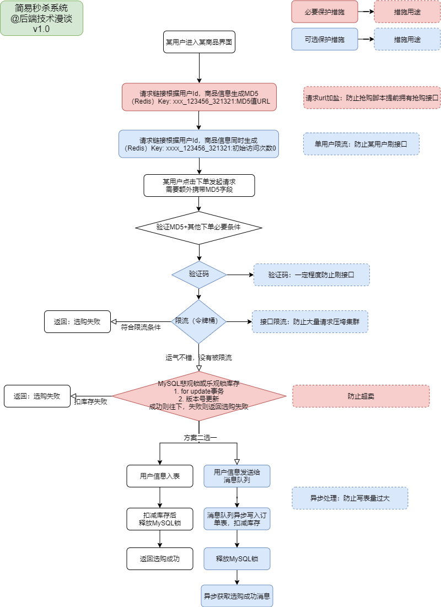
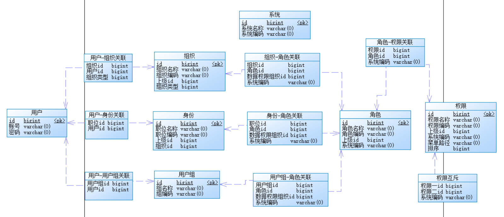

## 项目

### 1. 秒杀



#### 获取服务器时间：

#### 连接暴露：

​	1. URL 动态化

```JAVA
@RequestMapping(value = "/{md5}/execution", method = RequestMethod.POST)
```

 2. 限时获取 URL 地址

    可以把 上述 MD5 事先存入 zset 中（zadd key 2020010101 a），时间戳为 score，获取 index 为 0 的换回客户端（zrange key 0 0），然后定期删除过期的（zremrangebyscore key 2020010101 2020010101）

#### Redis 限流

​	**令牌桶：**存放令牌的容器，预先设定一定的容量。系统按设定的速度向桶中放置令牌，当桶中令牌满时，多余的令牌溢出。

​		单速双桶算法：

​		双速双桶算法：

​	**Google guava RateLimiter：**

​	**Redis RateLimiter：**基于令牌桶。

#### Redis 库存

​	系统初始化的时候将秒杀商品库存放入 redis 缓存。

**超卖：**

1. 超卖问题实际是 redis + MQ 解决。
2. 先将 mysql 中的商品库存信息写入 redis；
3. 然后每次下单都从 redis 中做库存**预减 1**，如果库存预减 1 后大于 0，则秒杀成功；
4. 进入消息队列，做异步减库存，下订单操作。

**Redis 事务：**

> MUTLI：开启事务
>
> EXEC：执行事务
>
> DISCARD：取消事务


​	减库存

#### 订单号唯一性：

​	**redis(INCR key_name)：**前缀 + 自增 ID。如果 key 不存在，则先初始化为 0，然后执行 incr (返回 1 )。

​	**zookeeper：**临时顺序节点。

> create（final String path, byte data[], List<ACL> acl, CreateMode createMode）
>
> | 参数名     | 说明                                                         |
> | ---------- | ------------------------------------------------------------ |
> | path       | 需要创建的数据节点的节点路径。比如，/zk-book/foo。           |
> | data[]     | 一个字节数组，是节点创建后的初始内容。                       |
> | acl        | 节点的 ACL 策略。                                            |
> | createMode | 节点类型，是一个枚举类型，通常有4种可选的节点类型：`持久（PERSISTENT）`、`持久顺序（PERSISTENT_SEQUENTIAL）`、`临时（EPHEMERAL）`、`临时顺序（EPHEMERAL_SEQUENTIAL）`。关于ZNode的节点特性，将在后面做详解介绍。 |
> | cb         | 注册一个`异步回调函数`。开发人员需要实现`StringCallBack接口`，主要是对下面这个方法的重写：`void processResult(int rc, String path, Object ctx, String name);`当服务端节点创建完毕后，ZooKeeper 客户端就会自动调用这个方法，这样就可以处理相关的业务逻辑了。 |
> | ctx        | 用于传递一个对象，可以在毁掉方法执行的时候使用，通常是一个上下文(Context)信息。 |
>
> 。

​	**雪花算法：**41 位时间戳 + 10 位机器 ID + 12 位自增序列。转换为长度 18 的长整型。

#### 分布式锁：

​	redisson()： 

​	redis：

  1. set nx px：`SET key value NX PX time`。key 存在则返回 0，否则返回 1。返回 1 则代表拿到锁。

     问题：

     	1. 一个线程获取到锁之后因为 BUG，导致解锁失败。解决方案：加上超时时间。

      	2. 超时情况下：多个线程同时等待锁释放，然后竞争锁，导致线程不安全现象。解决方案：getset

		2. getset：`GETSET key value`。设置新的值并返回旧值。其中一个线程拿到锁之后立即将 value 改变，同时将 old 值与原来的 value 值比较。

#### Mysql 乐观锁

CAS：version 版本

#### 限制单账户一件商品

​	redis：缓存**用户 + 订单 + 商品**信息，限制用户访问频率。

​	

### 2. 权限系统

​	**设计 1：**

​	用户 <----> [用户 关联 (组织/身份/用户组) 表] <----> [组织/身份/用户组] <----> [角色 关联 (组织/身份/用户组) 表] <----> 角色 <----> [角色 关联 权限 表] <----> 权限

​	


操作日志表	


